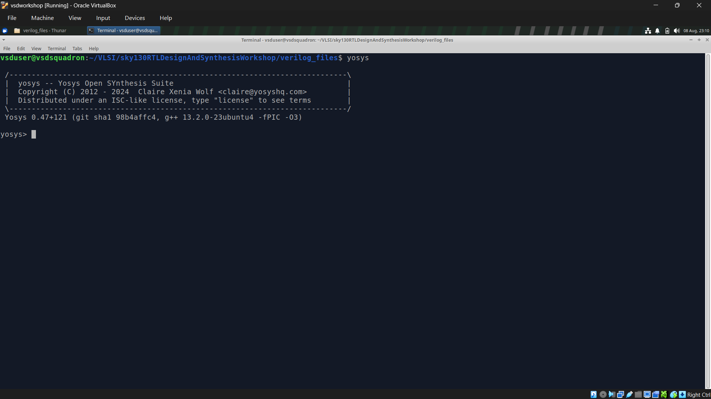
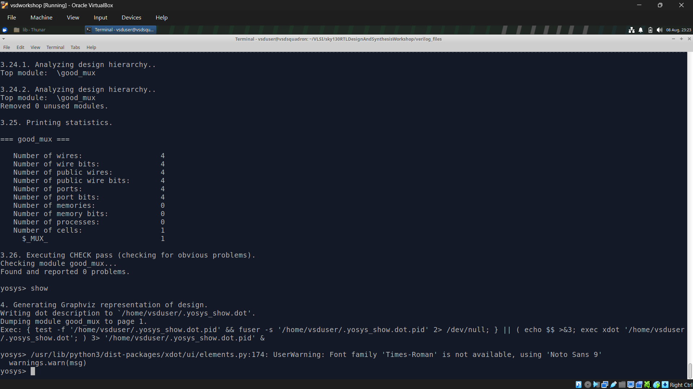
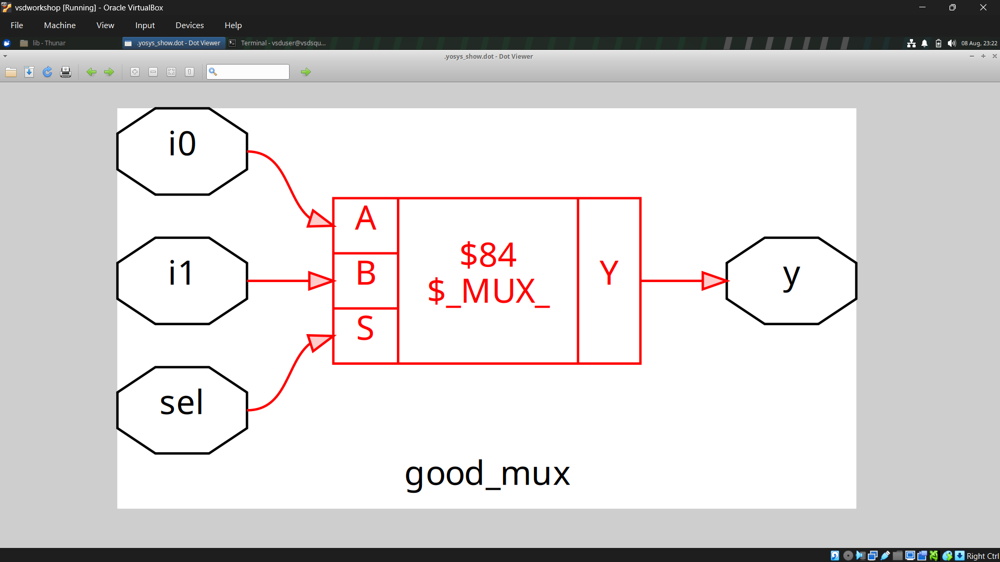
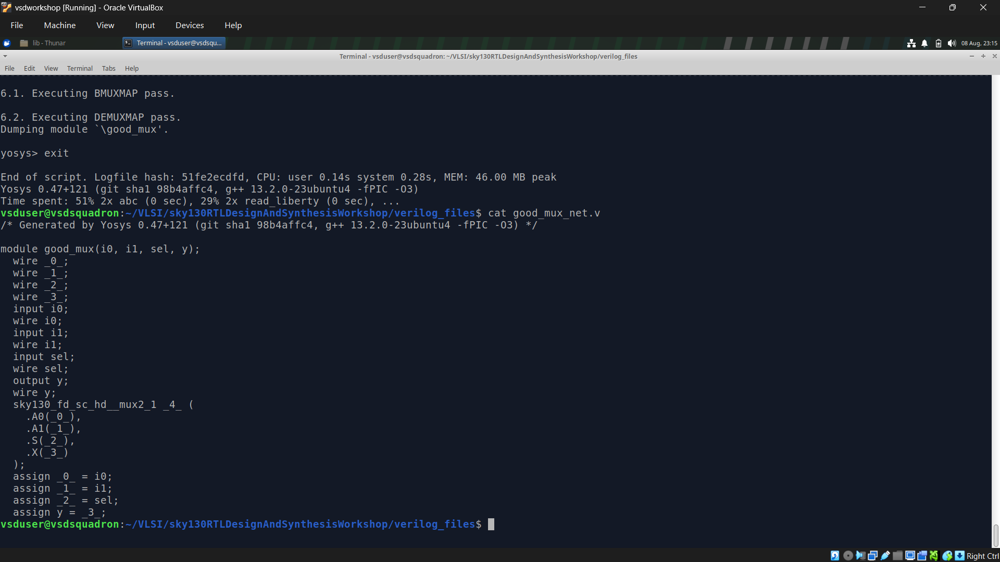

# Day 1 - Linux Environment Setup

## Overview

On the first day of the VLSI System Design (VSD) Workshop, the Linux Virtual Machine was successfully set up using Oracle VirtualBox. Basic Linux commands were practiced to become familiar with the terminal, followed by compiling and simulating a simple **2:1 Multiplexer** using Icarus Verilog and viewing the waveform in GTKWave.

---

# 1️⃣ Fundamental Concepts

## Testbench

A **testbench** is a Verilog module used to verify the functionality of a digital design. Unlike the design module, a testbench has **no input or output ports**. It generates different input combinations (stimulus), applies them to the Design Under Test (DUT), and observes the resulting outputs to ensure the design behaves as expected.

<p align="center">
  
</p>

<p align="center"><em>Figure 1: Basic structure of a Verilog testbench.</em></p>

The testbench consists of three main components:

- **Stimulus Generator** – Generates different input combinations for the design.
- **Design Under Test (DUT)** – The Verilog module being verified.
- **Stimulus Observer** – Monitors and checks the output generated by the design.

---

## Icarus Verilog Simulation Flow

Icarus Verilog is an open-source Verilog compiler and simulator used to verify digital designs before hardware implementation.

<p align="center">
  
</p>

<p align="center"><em>Figure 2: Icarus Verilog simulation flow.</em></p>

The simulation flow consists of the following steps:

1. **Design File** – Contains the Verilog implementation of the circuit.
2. **Testbench** – Applies input stimulus to the design.
3. **Icarus Verilog (`iverilog`)** – Compiles the design and testbench into an executable simulation.
4. **Simulation Execution** – Running the executable generates a **VCD (Value Change Dump)** file that records signal transitions.
5. **GTKWave** – Opens the generated VCD file to visualize and analyze signal waveforms.

---

## Synthesis

Simulation verifies whether a design functions correctly, whereas **synthesis** converts the RTL description into an actual hardware implementation.

<p align="center">
  
</p>

<p align="center"><em>Figure 3: RTL to Gate-Level Synthesis.</em></p>

During synthesis:

- The RTL Verilog code is translated into a network of logic gates.
- The synthesis tool maps the design to cells available in a standard cell library.
- The resulting gate-level representation is called a **netlist**, which is used in the later stages of ASIC or FPGA design.

Synthesis is the bridge between a behavioral RTL description and the physical hardware implementation.

---

# 2️⃣ Linux Virtual Machine

The Linux Virtual Machine serves as the development environment for the workshop. After importing the VSD virtual machine into Oracle VirtualBox, the system boots into a Linux desktop where all the required VLSI tools are pre-installed.

### Login Screen

<p align="center">
  
</p>

<p align="center"><em>Figure 4: Login screen of the VSD Linux Virtual Machine running on Oracle VirtualBox.</em></p>

---

# 3️⃣ Basic Linux Commands

The following Linux commands were used to navigate the file system and manage files during the workshop.

| Command | Description |
| ------- | ----------- |
| `pwd` | Display the current working directory |
| `ls` | List files and directories |
| `cd` | Change the current directory |
| `mkdir` | Create a new directory |
| `touch` | Create an empty file |
| `cp` | Copy files |
| `mv` | Move or rename files |
| `rm` | Delete files |
| `cat` | Display file contents |
| `clear` | Clear the terminal |


# 4️⃣ Practical Exercise – Simulating a 2:1 Multiplexer

## Step 1 – Install Required Tools

```bash
sudo apt install iverilog
sudo apt install gtkwave
```

These commands install **Icarus Verilog**, used for Verilog simulation, and **GTKWave**, used for viewing waveform outputs.

---
## RTL Design (2:1 Multiplexer)

The following Verilog code implements a **2:1 Multiplexer**. Based on the value of the select signal (`sel`), the output `y` is assigned either input `i0` or input `i1`.

```verilog
module good_mux (
    input i0,
    input i1,
    input sel,
    output reg y
);

always @(*) begin
    if (sel)
        y <= i1;
    else
        y <= i0;
end

endmodule
```

## Step 2 – Compile the Design

```bash
iverilog good_mux.v tb_good_mux.v
```

This command compiles the Verilog design (`good_mux.v`) together with its testbench (`tb_good_mux.v`) and generates an executable simulation file (`a.out`).

---

## Step 3 – Execute the Simulation

```bash
./a.out
```

Executing the compiled simulation runs the testbench and produces the waveform file (`tb_good_mux.vcd`) containing the simulation results.

---

### Terminal Output

<p align="center">
  
</p>

<p align="center"><em>Figure 7: Terminal output after compiling and executing the Verilog design using Icarus Verilog.</em></p>

The terminal confirms that the design and testbench were successfully compiled and executed, resulting in the generation of the waveform file (`tb_good_mux.vcd`).

---

## Step 5 – Open the Waveform

```bash
gtkwave tb_good_mux.vcd
```

The generated waveform file is opened in GTKWave, allowing the behavior of the 2:1 Multiplexer to be analyzed visually.

### Launching GTKWave

<p align="center">
  
</p>

<p align="center"><em>Figure 8: GTKWave loading the generated VCD file.</em></p>

GTKWave reads the generated VCD file and displays all the recorded signals, enabling detailed analysis of the circuit's behavior over time.

---

### Simulation Waveform

<p align="center">
  
</p>

<p align="center"><em>Figure 9: Simulation waveform of the 2:1 Multiplexer displayed in GTKWave.</em></p>

The waveform verifies the correct operation of the multiplexer. As the **select (`sel`)** signal changes, the output **`y`** follows either **`i0`** or **`i1`**, confirming that the RTL design functions as expected.

---

# 5️⃣ RTL Synthesis Using Yosys

After verifying the functionality of the RTL design through simulation, the next stage is **RTL synthesis**. Synthesis transforms the Verilog RTL description into a **gate-level netlist** by mapping the design to cells available in a standard cell library.

Unlike simulation, which only checks whether the design behaves correctly, synthesis prepares the circuit for actual hardware implementation.

---

## Launching Yosys

The synthesis process begins by opening the **Yosys Open Synthesis Suite**.

```bash
yosys
```

<p align="center">
  
</p>

<p align="center"><em>Figure 10: Launching the Yosys synthesis tool.</em></p>

Once inside the Yosys shell, synthesis commands can be executed to convert the RTL description into a gate-level implementation.

---

## RTL vs Gate-Level Design

| RTL Design | Gate-Level Netlist |
|------------|--------------------|
| Describes circuit functionality using Verilog. | Represents the design as interconnected logic gates. |
| Easier to understand and modify. | Ready for implementation and physical design. |
| Used during functional simulation. | Used for implementation and Gate-Level Simulation (GLS). |

---

## Synthesizing the Good Mux Design

The following commands were executed to synthesize the **good_mux** module.

```tcl
yosys

read_liberty -lib ../lib/sky130_fd_sc_hd__tt_025C_1v80.lib

read_verilog good_mux.v

synth -top good_mux

abc -liberty ../lib/sky130_fd_sc_hd__tt_025C_1v80.lib

write_verilog -noattr good_mux_net.v
```

### Command Explanation

| Command | Description |
|---------|-------------|
| `read_liberty` | Loads the SKY130 standard cell library. |
| `read_verilog` | Imports the RTL Verilog design. |
| `synth -top` | Synthesizes the specified top-level module. |
| `abc` | Performs technology mapping using the standard cell library. |
| `write_verilog` | Generates the synthesized gate-level netlist. |

---

## Synthesis Statistics

After synthesis, Yosys reports useful statistics about the generated hardware such as the number of ports, wires, cells, and logic elements used in the design.

For the **good_mux** design, the synthesis report shows that the circuit is implemented using a single multiplexer cell.

<p align="center">
  
</p>

<p align="center"><em>Figure 11: Yosys synthesis statistics for the Good Mux design.</em></p>

---

## Gate-Level Representation

Yosys can generate a graphical representation of the synthesized circuit using the **show** command. This creates a DOT graph that visually represents how the RTL has been converted into hardware.

```tcl
show
```

<p align="center">
  
</p>

<p align="center"><em>Figure 12: Gate-level representation of the synthesized Good Mux.</em></p>

The generated diagram clearly shows the multiplexer with its inputs (`i0`, `i1`, `sel`) and output (`y`), providing a simple visualization of the synthesized hardware.

---

## Generated Gate-Level Netlist

After synthesis, the following command generates the synthesized Verilog netlist.

```tcl
write_verilog -noattr good_mux_net.v
```

The generated netlist can be viewed using:

```bash
cat good_mux_net.v
```

<p align="center">
  
</p>

<p align="center"><em>Figure 13: Generated gate-level Verilog netlist.</em></p>

Unlike the original RTL code, this file contains interconnected standard cells from the SKY130 library that implement the same functionality.

---

## Standard Cell Library

Synthesis requires a **Standard Cell Library**, which contains pre-designed logic cells such as AND, OR, NAND, NOR, XOR gates, multiplexers, buffers, and flip-flops.

This workshop uses the **SKY130 HD Standard Cell Library**, allowing the synthesis tool to build the hardware implementation using optimized digital cells.

---

## Cell Flavors

A single logic gate is available in several different implementations, commonly referred to as **cell flavors**.

| High-Speed Cells | Low-Power Cells |
|------------------|-----------------|
| Lower propagation delay | Lower power consumption |
| Higher operating frequency | Smaller silicon area |
| Used for timing-critical paths | Used for non-critical paths |

During synthesis, Yosys automatically selects the most suitable cells depending on timing, area, and power requirements.

---

## Gate-Level Simulation (GLS)

Once synthesis is complete, the generated gate-level netlist can be verified using **Gate-Level Simulation (GLS)**.

Instead of simulating the original RTL design, the synthesized netlist is simulated using the **same testbench** together with the SKY130 standard cell models.

If the gate-level waveform matches the RTL waveform, it confirms that synthesis has preserved the original functionality of the design.

---

# Summary

- Reviewed the complete RTL-to-GDS design flow.
- Learned the purpose of a Verilog testbench.
- Performed RTL simulation using **Icarus Verilog**.
- Visualized waveforms using **GTKWave**.
- Practiced essential Linux commands inside the VSD Virtual Machine.
- Successfully designed and verified a **2:1 Multiplexer**.
- Introduced RTL synthesis using **Yosys**.
- Converted the RTL design into a **gate-level netlist**.
- Examined synthesis statistics reported by Yosys.
- Generated a graphical gate-level representation using the **show** command.
- Viewed the synthesized Verilog netlist.
- Understood the role of the **SKY130 Standard Cell Library** and different cell flavors.
- Learned how Gate-Level Simulation verifies that the synthesized hardware matches the original RTL design.
