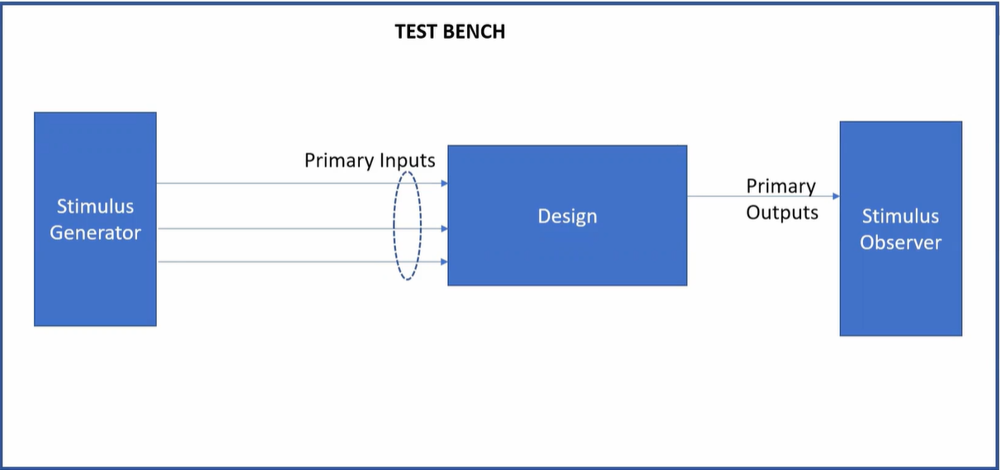
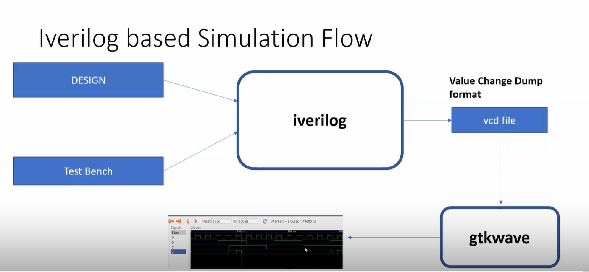
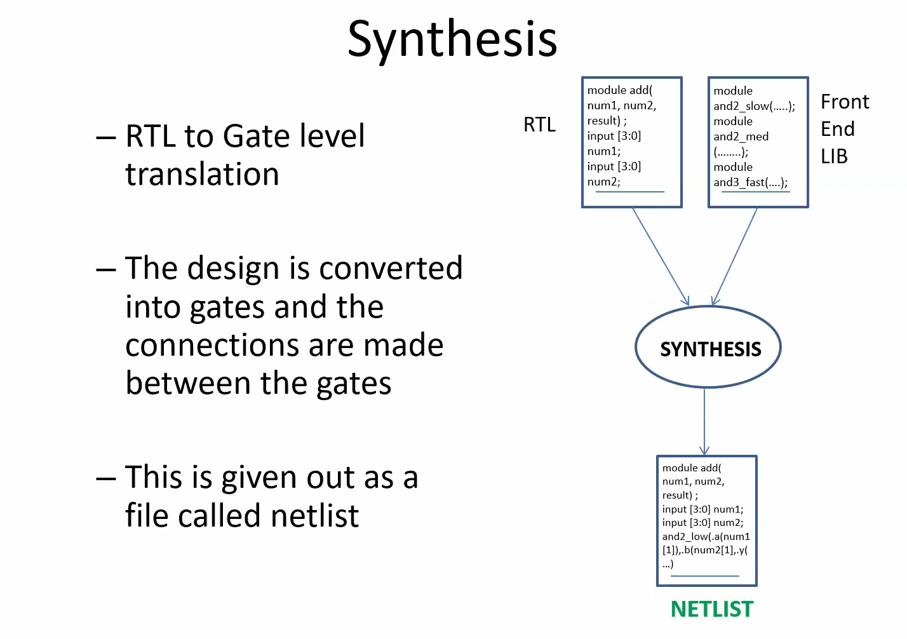
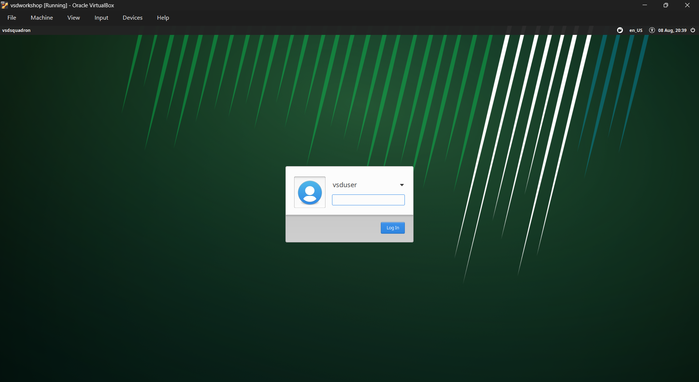
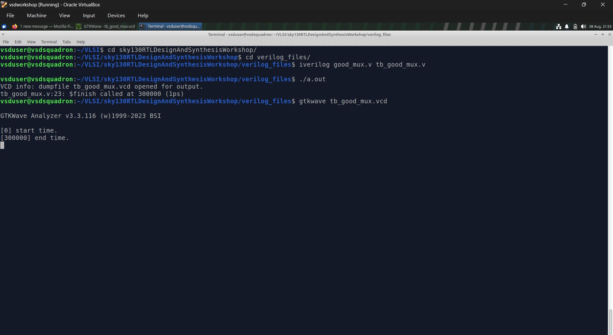
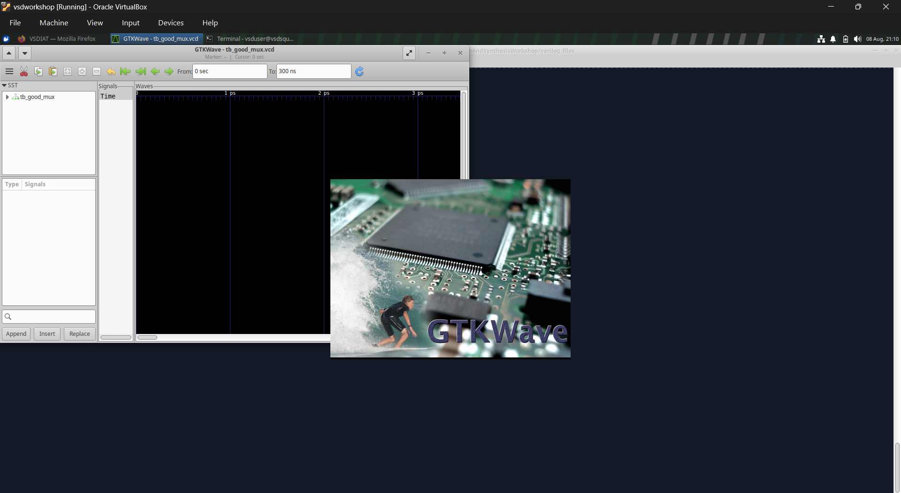
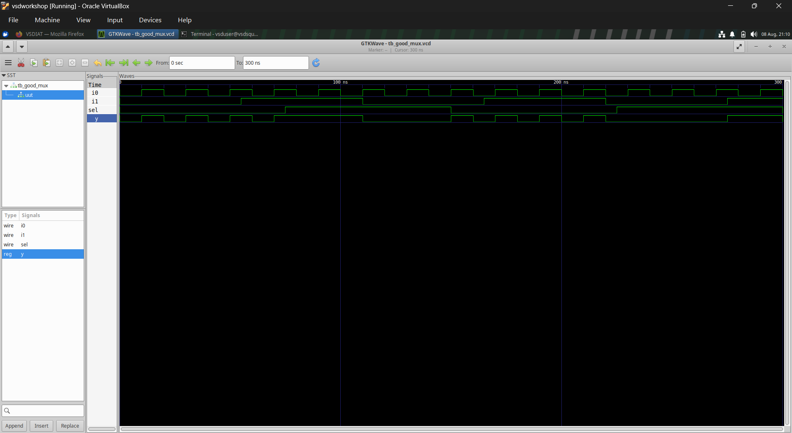

# Day 1 - Linux Environment Setup

## Overview

On the first day of the VLSI System Design (VSD) Workshop, the Linux Virtual Machine was successfully set up using Oracle VirtualBox. Basic Linux commands were practiced to become familiar with the terminal, followed by compiling and simulating a simple **2:1 Multiplexer** using Icarus Verilog and viewing the waveform in GTKWave.

---

# 1️⃣ Fundamental Concepts

## Testbench

A **testbench** is a Verilog module used to verify the functionality of a digital design. Unlike the design module, a testbench has **no input or output ports**. It generates different input combinations (stimulus), applies them to the Design Under Test (DUT), and observes the resulting outputs to ensure the design behaves as expected.

<p align="center">
  
</p>

<p align="center"><em>Figure 1: Basic structure of a Verilog testbench.</em></p>

The testbench consists of three main components:

- **Stimulus Generator** – Generates different input combinations for the design.
- **Design Under Test (DUT)** – The Verilog module being verified.
- **Stimulus Observer** – Monitors and checks the output generated by the design.

---

## Icarus Verilog Simulation Flow

Icarus Verilog is an open-source Verilog compiler and simulator used to verify digital designs before hardware implementation.

<p align="center">
  
</p>

<p align="center"><em>Figure 2: Icarus Verilog simulation flow.</em></p>

The simulation flow consists of the following steps:

1. **Design File** – Contains the Verilog implementation of the circuit.
2. **Testbench** – Applies input stimulus to the design.
3. **Icarus Verilog (`iverilog`)** – Compiles the design and testbench into an executable simulation.
4. **Simulation Execution** – Running the executable generates a **VCD (Value Change Dump)** file that records signal transitions.
5. **GTKWave** – Opens the generated VCD file to visualize and analyze signal waveforms.

---

## Synthesis

Simulation verifies whether a design functions correctly, whereas **synthesis** converts the RTL description into an actual hardware implementation.

<p align="center">
  
</p>

<p align="center"><em>Figure 3: RTL to Gate-Level Synthesis.</em></p>

During synthesis:

- The RTL Verilog code is translated into a network of logic gates.
- The synthesis tool maps the design to cells available in a standard cell library.
- The resulting gate-level representation is called a **netlist**, which is used in the later stages of ASIC or FPGA design.

Synthesis is the bridge between a behavioral RTL description and the physical hardware implementation.

---

# 2️⃣ Linux Virtual Machine

The Linux Virtual Machine serves as the development environment for the workshop. After importing the VSD virtual machine into Oracle VirtualBox, the system boots into a Linux desktop where all the required VLSI tools are pre-installed.

### Login Screen

<p align="center">
  
</p>

<p align="center"><em>Figure 4: Login screen of the VSD Linux Virtual Machine running on Oracle VirtualBox.</em></p>

---

# 3️⃣ Basic Linux Commands

The following Linux commands were used to navigate the file system and manage files during the workshop.

| Command | Description |
| ------- | ----------- |
| `pwd` | Display the current working directory |
| `ls` | List files and directories |
| `cd` | Change the current directory |
| `mkdir` | Create a new directory |
| `touch` | Create an empty file |
| `cp` | Copy files |
| `mv` | Move or rename files |
| `rm` | Delete files |
| `cat` | Display file contents |
| `clear` | Clear the terminal |


# 4️⃣ Practical Exercise – Simulating a 2:1 Multiplexer

## Step 1 – Install Required Tools

```bash
sudo apt install iverilog
sudo apt install gtkwave
```

These commands install **Icarus Verilog**, used for Verilog simulation, and **GTKWave**, used for viewing waveform outputs.

---
## RTL Design (2:1 Multiplexer)

The following Verilog code implements a **2:1 Multiplexer**. Based on the value of the select signal (`sel`), the output `y` is assigned either input `i0` or input `i1`.

```verilog
module good_mux (
    input i0,
    input i1,
    input sel,
    output reg y
);

always @(*) begin
    if (sel)
        y <= i1;
    else
        y <= i0;
end

endmodule
```

## Step 2 – Compile the Design

```bash
iverilog good_mux.v tb_good_mux.v
```

This command compiles the Verilog design (`good_mux.v`) together with its testbench (`tb_good_mux.v`) and generates an executable simulation file (`a.out`).

---

## Step 3 – Execute the Simulation

```bash
./a.out
```

Executing the compiled simulation runs the testbench and produces the waveform file (`tb_good_mux.vcd`) containing the simulation results.

---

### Terminal Output

<p align="center">
  
</p>

<p align="center"><em>Figure 7: Terminal output after compiling and executing the Verilog design using Icarus Verilog.</em></p>

The terminal confirms that the design and testbench were successfully compiled and executed, resulting in the generation of the waveform file (`tb_good_mux.vcd`).

---

## Step 5 – Open the Waveform

```bash
gtkwave tb_good_mux.vcd
```

The generated waveform file is opened in GTKWave, allowing the behavior of the 2:1 Multiplexer to be analyzed visually.

### Launching GTKWave

<p align="center">
  
</p>

<p align="center"><em>Figure 8: GTKWave loading the generated VCD file.</em></p>

GTKWave reads the generated VCD file and displays all the recorded signals, enabling detailed analysis of the circuit's behavior over time.

---

### Simulation Waveform

<p align="center">
  
</p>

<p align="center"><em>Figure 9: Simulation waveform of the 2:1 Multiplexer displayed in GTKWave.</em></p>

The waveform verifies the correct operation of the multiplexer. As the **select (`sel`)** signal changes, the output **`y`** follows either **`i0`** or **`i1`**, confirming that the RTL design functions as expected.

# Summary

- Successfully launched the Linux Virtual Machine.
- Practiced essential Linux terminal commands.
- Compiled a Verilog design using Icarus Verilog.
- Executed the simulation and generated a waveform.
- Verified the functionality of the 2:1 Multiplexer using GTKWave.
