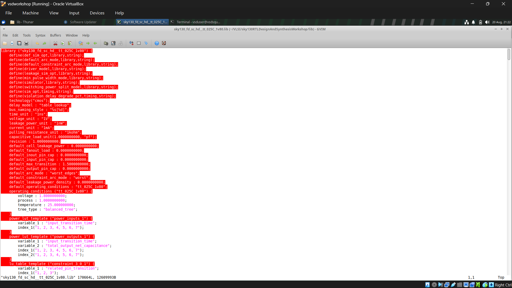
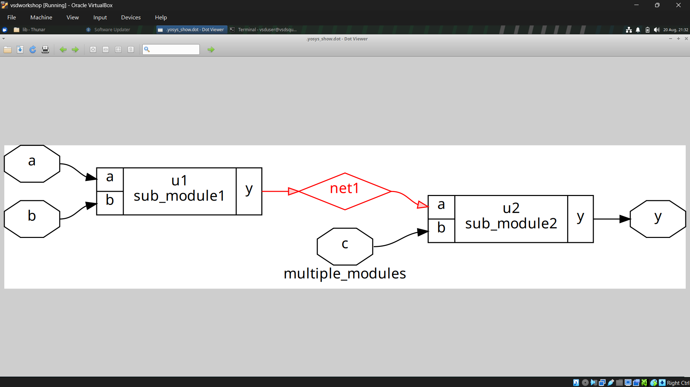
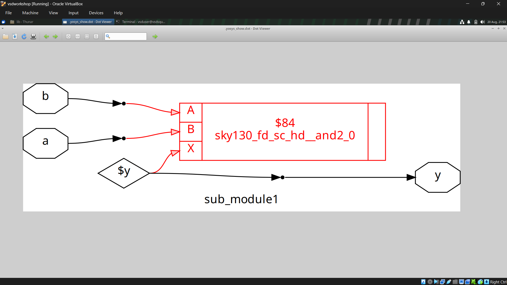
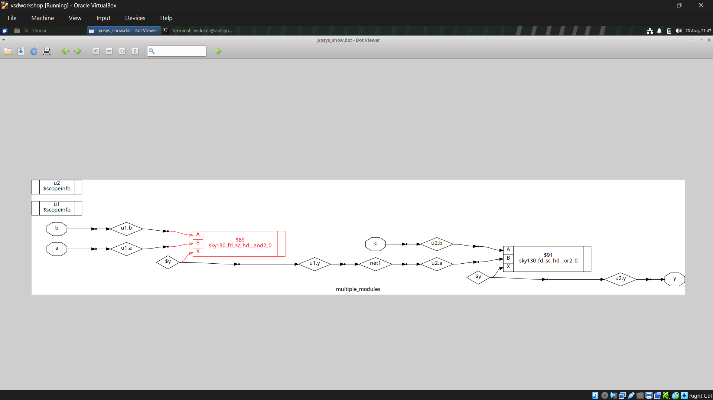
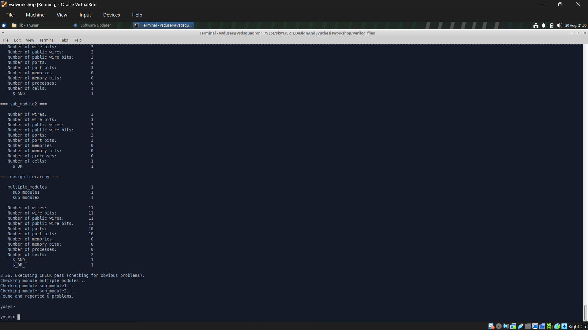
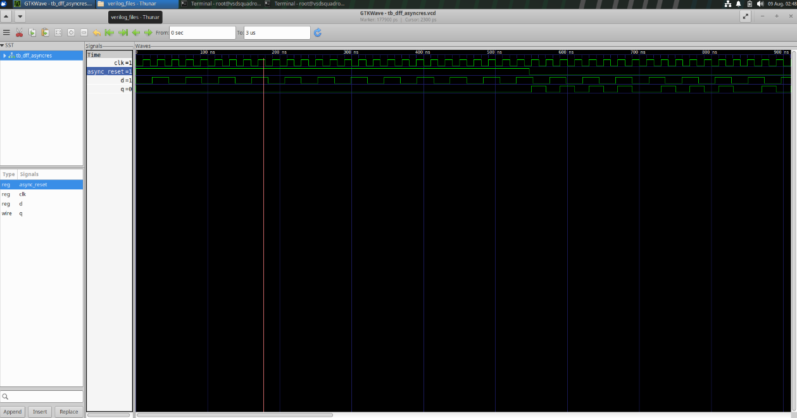
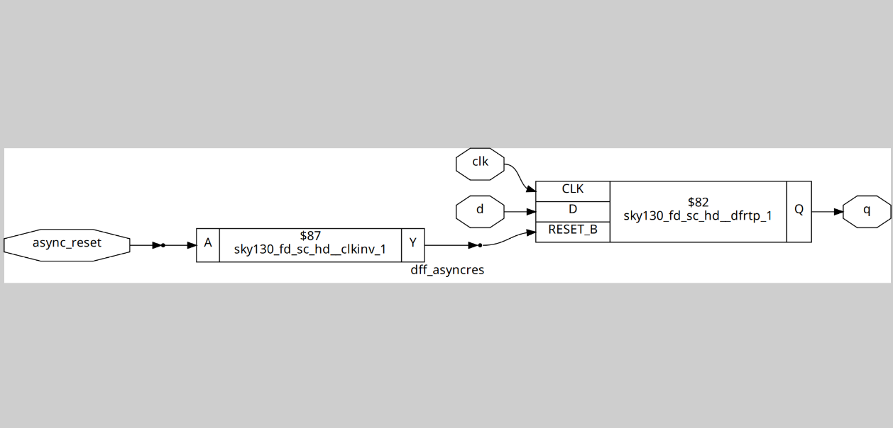

# Day 2 – Timing Libraries, Synthesis Approaches & Flip-Flop Coding Styles

## Objective

Day 2 builds on the basic simulation flow covered in Day 1 and introduces three important concepts needed when moving from RTL simulation toward synthesis:

1. Understanding what is present inside a `.lib` timing library.
2. Comparing hierarchical and flattened synthesis using Yosys.
3. Writing clean, synthesis-friendly RTL for flip-flops with different reset and set behaviors.

The goal is to understand how RTL code is connected to real standard cells and how synthesis tools transform that RTL into hardware.

---

## Contents

1. [Understanding the SKY130 Timing Library](#1-understanding-the-sky130-timing-library)
2. [Hierarchical vs. Flattened Synthesis](#2-hierarchical-vs-flattened-synthesis)
3. [Flip-Flop Coding Styles](#3-flip-flop-coding-styles)
4. [Lab Execution](#4-lab-execution)
5. [Conclusion](#5-conclusion)

---

# 1. Understanding the SKY130 Timing Library

## What is the SKY130 PDK?

The **SKY130 PDK** is SkyWater Technology's open-source **130 nm Process Design Kit**.

It provides the information required by design and synthesis tools to work with the SKY130 semiconductor process. One important part of the PDK is its collection of characterized **standard cell libraries**.

These libraries contain standard cells such as:

* AND gates
* OR gates
* NAND gates
* Flip-flops
* Other logic and sequential cells

The libraries also contain important information such as:

* Cell timing
* Input capacitance
* Power characteristics
* Area-related information

Yosys and other synthesis tools use this information to map generic RTL logic into real standard cells that can be used in a silicon implementation.

---

## Decoding the Library Filename

The timing library used in this workshop is:

```text
sky130_fd_sc_hd__tt_025C_1v80.lib
```

The filename contains information about the process, voltage, and temperature conditions under which the cells were characterized.

| Segment | Meaning                              |
| ------- | ------------------------------------ |
| `tt`    | Typical process corner               |
| `025C`  | Characterized at 25°C                |
| `1v80`  | Characterized at a 1.8 V core supply |

The `tt` designation represents the **typical-typical process corner**, as opposed to other corners such as fast-fast or slow-slow.

Therefore, the complete filename tells the synthesis and analysis tools which **Process, Voltage, and Temperature (PVT)** conditions the timing and power values are based on.



---

## Inspecting the `.lib` File

The `.lib` file can be opened and inspected using a text editor such as `gedit`.

Install `gedit` if it is not already available:

```bash
sudo apt install gedit
```

Then open the library:

```bash
gedit sky130_fd_sc_hd__tt_025C_1v80.lib
```

Inside the file, the different standard cells are described along with their electrical and timing information.

For example, the library contains information about:

* Standard cell definitions
* Timing arcs
* Input capacitance
* Power characteristics
* Cell behavior

This is the information that synthesis and timing tools use when mapping generic RTL logic to technology-specific standard cells.

---

# 2. Hierarchical vs. Flattened Synthesis

Synthesis can be performed while keeping the original RTL module hierarchy or by removing that hierarchy and creating a single flattened design.

The two approaches are known as:

* **Hierarchical synthesis**
* **Flattened synthesis**

Understanding the difference is important because each approach provides different benefits during optimization, debugging, and implementation.

---

## Hierarchical Synthesis

In **hierarchical synthesis**, the module structure of the RTL is preserved.

Each sub-module remains as a separate block instead of having all of its logic immediately merged into one flat design.

### Advantages

* Synthesis can be faster, especially for larger designs.
* Results are easier to trace back to the original RTL modules.
* Debugging becomes easier because the original module structure is retained.
* It works naturally with modular and block-based design flows.

### Trade-offs

* Optimization is generally limited across module boundaries.
* Logic inside different modules cannot always be optimized together.
* Some reporting and analysis operations may require additional setup when working across hierarchy boundaries.

---

## Example: `multiple_modules.v`

The following example contains two sub-modules that are instantiated inside a top-level module:

```verilog
module sub_module1 (input a, input b, output y);
    assign y = a & b;
endmodule

module sub_module2 (input a, input b, output y);
    assign y = a | b;
endmodule

module multiple_modules (input a, input b, input c, output y);
    wire net1;

    sub_module1 u1 (.a(a), .b(b), .y(net1));   // net1 = a & b
    sub_module2 u2 (.a(net1), .b(c), .y(y));   // y = net1 | c
endmodule
```

In this design:

* `sub_module1` performs an AND operation.
* `sub_module2` performs an OR operation.
* `net1` connects the output of `sub_module1` to the input of `sub_module2`.
* The final output is:

```text
y = (a & b) | c
```

The top-level module, `multiple_modules`, contains `sub_module1` and `sub_module2` as separate instantiated blocks.

When the following Yosys command is used:

```text
synth -top multiple_modules
```

without explicitly applying a `flatten` step, the module hierarchy can be retained in the resulting design.

This allows `u1` and `u2` to remain identifiable as separate sub-blocks.







---

## Flattened Synthesis

In **flattened synthesis**, the module hierarchy is removed and the logic from the different modules is combined into a single netlist.

Yosys provides the `flatten` command for this purpose.

The overall process can be thought of as:

```text
RTL Modules
    ↓
Remove Module Hierarchy
    ↓
Single Flat Design
    ↓
Optimization
    ↓
Final Netlist
```

### Advantages

* Allows optimization across the boundaries of the original modules.
* Gives the synthesis tool a complete view of the design.
* Can enable more aggressive whole-design optimization.
* Produces a single unified netlist, which can simplify some downstream processes.

### Trade-offs

* Synthesis can take longer for large designs.
* Debugging becomes more difficult because the original module boundaries are removed.
* It becomes harder to directly map sections of the synthesized design back to individual RTL modules.
* Larger and more complex netlists can increase memory usage.







---

## Hierarchical vs. Flattened Synthesis – Comparison

| Aspect                    | Hierarchical Synthesis                     | Flattened Synthesis               |
| ------------------------- | ------------------------------------------ | --------------------------------- |
| Module hierarchy          | Preserved                                  | Removed / collapsed               |
| Optimization scope        | Mainly within modules                      | Across the entire design          |
| Runtime for large designs | Generally faster                           | Generally slower                  |
| Debugging                 | Easier                                     | More difficult                    |
| RTL traceability          | Better                                     | Reduced                           |
| Netlist structure         | Modular                                    | Single unified design             |
| Optimization potential    | More limited across boundaries             | Higher across the whole design    |
| Typical use               | Modularity, debugging, reporting and reuse | Maximum whole-design optimization |

---

# 3. Flip-Flop Coding Styles

Flip-flops are fundamental storage elements used in sequential digital circuits.

The way a flip-flop is written in RTL is important because synthesis tools use the RTL description to determine what type of hardware needs to be created.

Different coding styles can result in different types of flip-flop hardware.

Three common styles covered in this section are:

1. Asynchronous reset
2. Asynchronous set
3. Synchronous reset

---

## Asynchronous Reset D Flip-Flop

An asynchronous reset can change the output immediately, without waiting for a clock edge.

### Verilog Code

```verilog
module dff_asyncres (
    input clk,
    input async_reset,
    input d,
    output reg q
);

  always @ (posedge clk, posedge async_reset)
    if (async_reset)
      q <= 1'b0;
    else
      q <= d;

endmodule
```

### How It Works

The sensitivity list contains both:

```verilog
posedge clk
```

and:

```verilog
posedge async_reset
```

This means the flip-flop responds when either the clock rises or the asynchronous reset rises.

When `async_reset` becomes `1`:

```verilog
q <= 1'b0;
```

is executed immediately.

The clock does not need to transition for the reset to take effect.

Therefore:

> The asynchronous reset can force `q` to `0` independently of the clock.

When the reset is not active, the flip-flop captures the input `d` on the rising edge of the clock.

---

## Asynchronous Set D Flip-Flop

An asynchronous set works in a similar way to an asynchronous reset, but instead of forcing the output to `0`, it forces the output to `1`.

### Verilog Code

```verilog
module dff_async_set (
    input clk,
    input async_set,
    input d,
    output reg q
);

  always @ (posedge clk, posedge async_set)
    if (async_set)
      q <= 1'b1;
    else
      q <= d;

endmodule
```

### How It Works

The sensitivity list contains:

```verilog
posedge clk
```

and:

```verilog
posedge async_set
```

When `async_set` becomes `1`, the output is immediately forced to:

```verilog
q <= 1'b1;
```

The clock does not need to transition.

When `async_set` is inactive, the flip-flop captures `d` on the rising edge of the clock.

Therefore:

> The asynchronous set can force `q` to `1` independently of the clock.

---

## Synchronous Reset D Flip-Flop

A synchronous reset behaves differently from an asynchronous reset.

The reset is checked only when the clock has a rising edge.

### Verilog Code

```verilog
module dff_syncres (
    input clk,
    input sync_reset,
    input d,
    output reg q
);

  always @ (posedge clk)
    if (sync_reset)
      q <= 1'b0;
    else
      q <= d;

endmodule
```

### How It Works

The sensitivity list contains only:

```verilog
posedge clk
```

The reset is therefore checked only at the rising edge of the clock.

If `sync_reset` is `1` when the clock rises:

```verilog
q <= 1'b0;
```

If `sync_reset` is `0`:

```verilog
q <= d;
```

Unlike the asynchronous reset, changing `sync_reset` by itself does not immediately change `q`.

Therefore:

> A synchronous reset takes effect only on a clock edge.

---

## Asynchronous vs. Synchronous Reset

| Feature                             | Asynchronous Reset       | Synchronous Reset               |
| ----------------------------------- | ------------------------ | ------------------------------- |
| Reset sensitivity                   | Reset and clock          | Clock only                      |
| Requires clock edge?                | No                       | Yes                             |
| Reset acts immediately?             | Yes                      | No                              |
| Reset included in sensitivity list? | Yes                      | No                              |
| Typical use                         | Immediate reset behavior | Clock-controlled reset behavior |

---

# 4. Lab Execution

## Simulation Using Icarus Verilog

The asynchronous reset flip-flop can first be simulated using **Icarus Verilog**.

Compile the design and testbench:

```bash
iverilog dff_asyncres.v tb_dff_asyncres.v
```

Run the generated simulation:

```bash
./a.out
```

The simulation generates a VCD waveform file, which can then be opened using GTKWave:

```bash
gtkwave tb_dff_asyncres.vcd
```

The waveform can be used to observe how the asynchronous reset affects the flip-flop output.




---

## Synthesis Using Yosys

After simulation, the flip-flop can be synthesized using **Yosys**.

Start Yosys:

```bash
yosys
```

Load the SKY130 standard cell library:

```text
read_liberty -lib /path/to/sky130_fd_sc_hd__tt_025C_1v80.lib
```

Read the Verilog design:

```text
read_verilog dff_asyncres.v
```

Synthesize the top-level module:

```text
synth -top dff_asyncres
```

Map the inferred flip-flop to a flip-flop cell from the standard cell library:

```text
dfflibmap -liberty /path/to/sky130_fd_sc_hd__tt_025C_1v80.lib
```

Perform technology mapping for the remaining logic:

```text
abc -liberty /path/to/sky130_fd_sc_hd__tt_025C_1v80.lib
```

Finally, display the synthesized netlist:

```text
show
```

### Complete Yosys Flow

The complete sequence is:

```text
read_liberty -lib /path/to/sky130_fd_sc_hd__tt_025C_1v80.lib
read_verilog dff_asyncres.v
synth -top dff_asyncres
dfflibmap -liberty /path/to/sky130_fd_sc_hd__tt_025C_1v80.lib
abc -liberty /path/to/sky130_fd_sc_hd__tt_025C_1v80.lib
show
```

---

## Why is `dfflibmap` Needed?

Day 1 mainly dealt with **combinational logic**, such as the 2:1 multiplexer.

Day 2 introduces sequential logic, so the synthesis flow now needs to handle flip-flops.

When Yosys reads the RTL, it can recognize the flip-flop behavior and infer a generic flip-flop.

The command:

```text
dfflibmap
```

maps that generic flip-flop to an appropriate sequential standard cell available in the SKY130 library.

After that,:

```text
abc
```

is used to perform technology mapping for the remaining combinational logic.

Therefore, the important difference from the simpler combinational flow is that sequential elements require **flip-flop library mapping**.

### Simplified Flow

```text
RTL Flip-Flop
     ↓
Yosys RTL Processing
     ↓
Generic Flip-Flop
     ↓
dfflibmap
     ↓
SKY130 Flip-Flop Cell
     ↓
ABC Technology Mapping
     ↓
Synthesized Netlist
```




---

# 5. Conclusion

Day 2 connects the RTL description of a design with the standard cells that can eventually be used to implement it in silicon.

The main concepts covered were:

* Understanding the purpose of the **SKY130 PDK**.
* Understanding what information is contained inside a `.lib` timing library.
* Understanding the meaning of the PVT information in the library filename.
* Comparing **hierarchical synthesis** and **flattened synthesis**.
* Understanding the advantages and trade-offs of preserving or removing module hierarchy.
* Writing RTL for **asynchronous reset**, **asynchronous set**, and **synchronous reset** flip-flops.
* Simulating flip-flop designs using **Icarus Verilog** and **GTKWave**.
* Synthesizing the flip-flop using **Yosys**.
* Understanding why `dfflibmap` is important when mapping inferred flip-flops to real standard cells.

The `dfflibmap` step is especially important because sequential elements require explicit mapping to appropriate library flip-flop cells. This becomes increasingly important as the design moves beyond the purely combinational logic explored in Day 1.

Overall, Day 2 demonstrates how a simple RTL description progresses from simulation to synthesis and eventually toward real technology-specific hardware implementation.

