# Day 5 – IF-ELSE, CASE, and Looping Constructs

## Objective

Day 5 focuses on RTL coding constructs used to describe **conditional logic and repetitive hardware structures** in Verilog.

The experiments cover:

* `if-else` and priority logic
* `case` statements and selection logic
* Inferred latches due to incomplete assignments
* Overlapping `casez` conditions
* Synthesis optimization
* Procedural `for` loops
* Generate `for` loops
* MUX and DEMUX implementations
* Ripple Carry Adder using a generate loop
* RTL waveforms and synthesized netlists

---

## Table of Contents

* [RTL Coding Styles: IF-ELSE and CASE](#rtl-coding-styles-if-else-and-case)
* [Inferred Latches](#inferred-latches)
* [Labs 1–2: Incomplete IF Statements](#labs-12-incomplete-if-statements)
* [Labs 3–5: CASE Statements](#labs-35-case-statements)
* [Lab 6: Overlapping CASE Statements](#lab-6-overlapping-case-statements)
* [Redundancy Optimization During Synthesis](#redundancy-optimization-during-synthesis)
* [Looping Constructs in Verilog](#looping-constructs-in-verilog)
* [Labs 7–10: Loop-Based MUX, DEMUX, and RCA](#labs-710-loop-based-mux-demux-and-rca)
* [Overall Summary](#overall-summary)

---

## RTL Coding Styles: IF-ELSE and CASE

RTL describes digital hardware before it is converted into gates by synthesis.

### Priority Logic Using IF-ELSE

`if-else` evaluates conditions in order. If multiple conditions are true, the **first true condition gets priority**.

```verilog
always @(*) begin
    if (condition_1)
        y = value_1;
    else if (condition_2)
        y = value_2;
    else
        y = value_3;
end
```

| Statement | Priority |
| --------- | -------- |
| `if`      | Highest  |
| `else if` | Next     |
| `else`    | Lowest   |

Common applications include priority encoders and control logic.

### Selection Logic Using CASE

`case` compares a selector with different possible values.

```verilog
always @(*) begin
    case (sel)
        2'b00: y = a;
        2'b01: y = b;
        2'b10: y = c;
        default: y = d;
    endcase
end
```

Common applications:

* MUX
* Decoder
* FSM
* Control logic

### IF-ELSE vs CASE

| Feature      | IF-ELSE                   | CASE                 |
| ------------ | ------------------------- | -------------------- |
| Main purpose | Priority decisions        | Multi-way selection  |
| Evaluation   | Sequential                | Selector-based       |
| Typical use  | Priority logic, control   | MUX, decoder, FSM    |
| Main concern | Ordering and completeness | Coverage and overlap |

---

## Inferred Latches

A latch is a level-sensitive storage element that retains its previous value.

An **unintended latch** can be inferred when a combinational output is not assigned for every possible condition.

Example:

```verilog
always @(*) begin
    if (enable)
        y = data;
end
```

When `enable = 0`, `y` is not assigned, so it must retain its previous value.

### Complete Version

```verilog
always @(*) begin
    if (enable)
        y = data;
    else
        y = 1'b0;
end
```

A default assignment can also be used:

```verilog
always @(*) begin
    y = 1'b0;

    if (enable)
        y = data;
end
```

### Latch vs Flip-Flop

```verilog
always @(posedge clk or posedge reset) begin
    if (reset)
        count <= 0;
    else if (enable)
        count <= count + 1;
end
```

Here, `count` is stored in flip-flops because the block is triggered by a clock edge. Retaining its value when `enable = 0` is **intentional sequential behavior**, not latch inference.

---

# Labs 1–2: Incomplete IF Statements

## Lab 1 – Incomplete IF Statement

**File:** `incomp_if.v`

```verilog
always @(*) begin
    if (i0)
        y = i1;
end
```

| `i0` | Output        |
| ---- | ------------- |
| `1`  | `y = i1`      |
| `0`  | No assignment |

When `i0 = 0`, `y` retains its previous value, causing latch inference.

### Waveform

<!-- Add waveform image here -->

<p align="center">
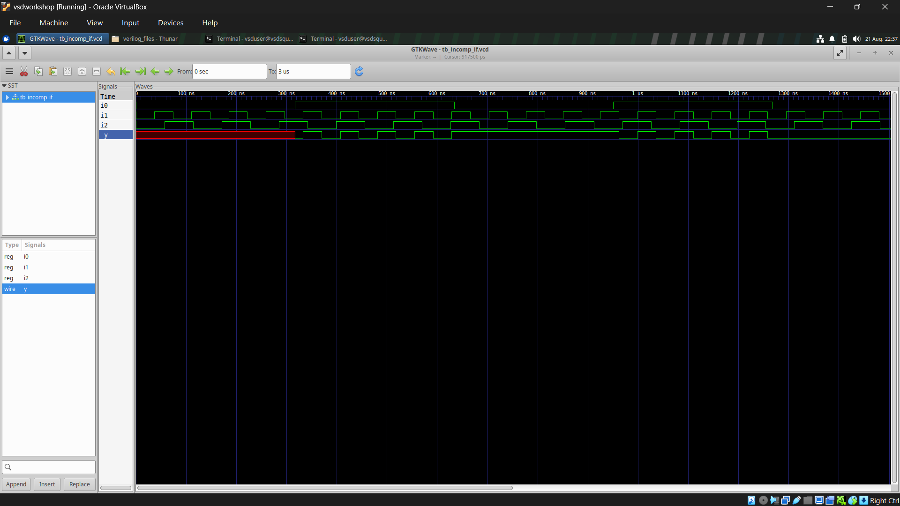
</p>

### Synthesized Netlist

<!-- Add synthesized netlist image here -->

<p align="center">
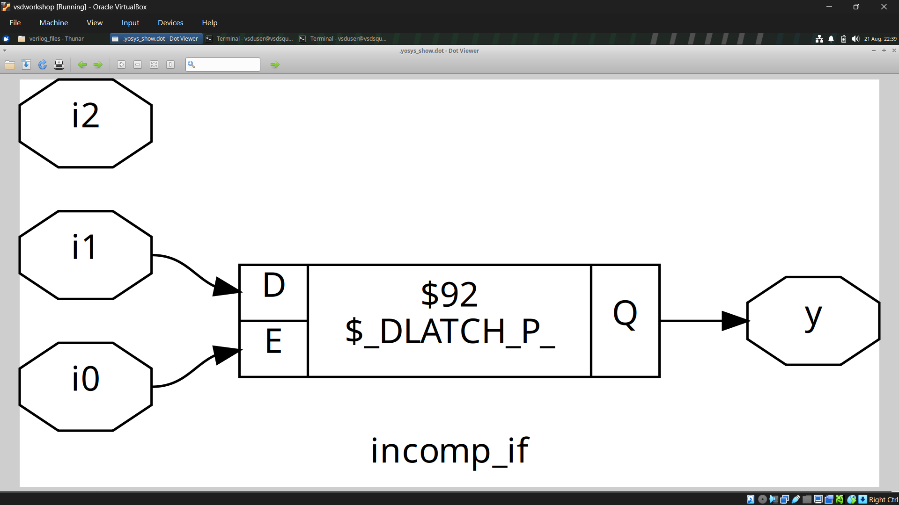
</p>

**Learning:** Missing assignments in combinational logic can infer unintended latches.

---

## Lab 2 – Incomplete IF-ELSE Statement

**File:** `incomp_if2.v`

```verilog
always @(*) begin
    if (i0)
        y = i1;
    else if (i2)
        y = i3;
end
```

| `i0` | `i2` | Output        |
| ---- | ---- | ------------- |
| `1`  | X    | `y = i1`      |
| `0`  | `1`  | `y = i3`      |
| `0`  | `0`  | No assignment |

The final condition is uncovered, so a latch may be inferred.

### Synthesized Netlist

<p align="center">
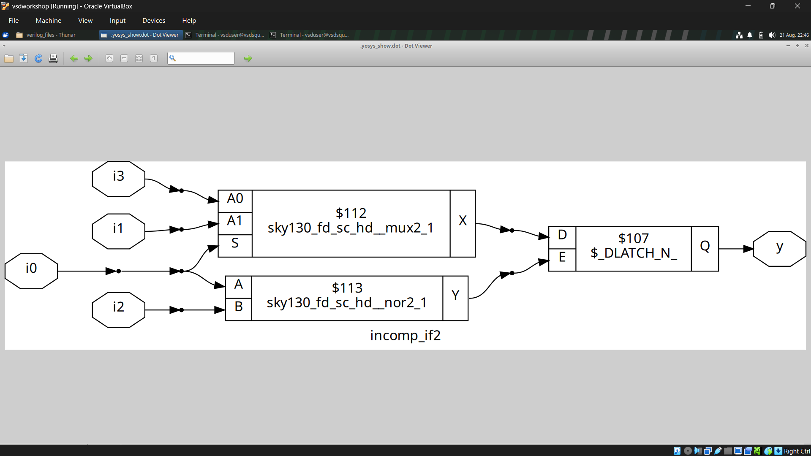
</p>

### Complete Version

```verilog
always @(*) begin
    if (i0)
        y = i1;
    else if (i2)
        y = i3;
    else
        y = 1'b0;
end
```

**Learning:** An `else-if` chain can still be incomplete. Every combinational path must provide a defined output.

---

# Labs 3–5: CASE Statements

## Lab 3 – Incomplete CASE Statement

**File:** `incomp_case.v`

```verilog
always @(*) begin
    case (sel)
        2'b00: y = i0;
        2'b01: y = i1;
    endcase
end
```

A 2-bit selector has four combinations, but only two are covered.

| `sel`   | Output        |
| ------- | ------------- |
| `2'b00` | `y = i0`      |
| `2'b01` | `y = i1`      |
| `2'b10` | No assignment |
| `2'b11` | No assignment |

The uncovered conditions can cause latch inference.

### Waveform

<p align="center">
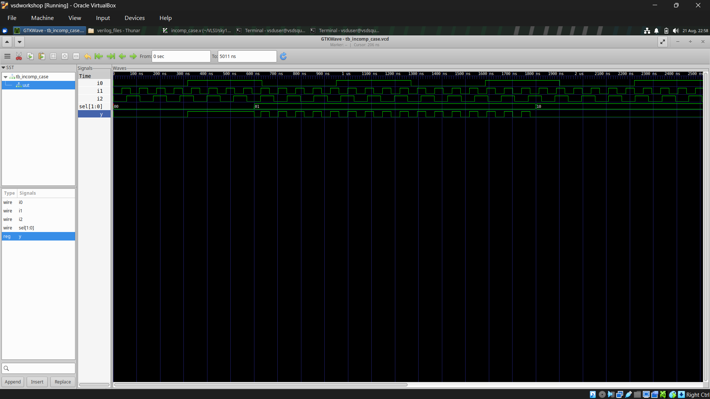
</p>

### Synthesized Netlist

<p align="center">
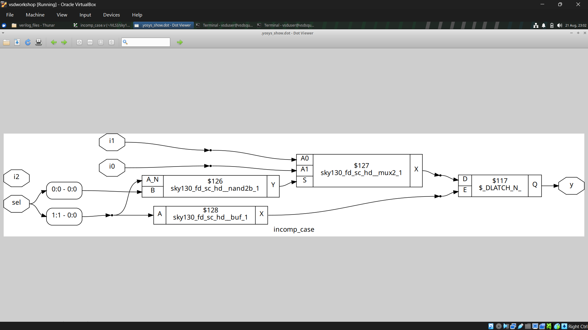
</p>

**Learning:** Combinational `case` statements should have complete coverage or a suitable `default`.

---

## Lab 4 – Complete CASE Statement

**File:** `comp_case.v`

```verilog
always @(*) begin
    case (sel)
        2'b00: y = i0;
        2'b01: y = i1;
        default: y = i2;
    endcase
end
```

| `sel`   | Output   |
| ------- | -------- |
| `2'b00` | `y = i0` |
| `2'b01` | `y = i1` |
| `2'b10` | `y = i2` |
| `2'b11` | `y = i2` |

### Waveform

<p align="center">

</p>

### Synthesized Netlist

<p align="center">
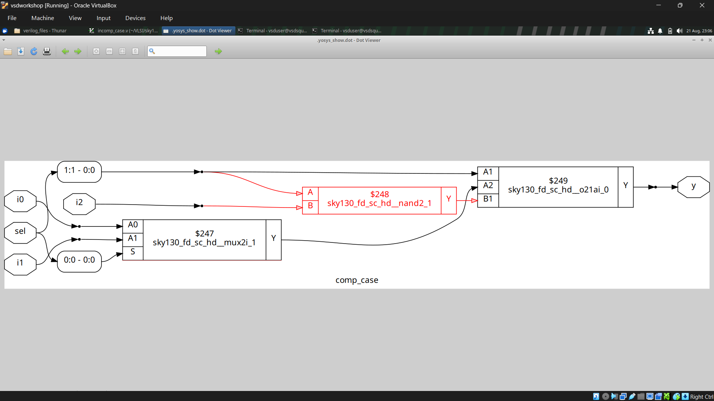
</p>

**Learning:** `default` provides defined behavior for unspecified selector values.

---

## Lab 5 – Partial Output Assignment

**File:** `partial_case_assign.v`

```verilog
always @(*) begin
    case (sel)

        2'b00: begin
            y = i0;
            x = i2;
        end

        2'b01: begin
            y = i1;
        end

        default: begin
            y = i3;
            x = i4;
        end

    endcase
end
```

`y` is assigned in every branch, but `x` is not assigned when `sel = 2'b01`.

| `sel`   | `y`  | `x`            |
| ------- | ---- | -------------- |
| `2'b00` | `i0` | `i2`           |
| `2'b01` | `i1` | Previous value |
| Default | `i3` | `i4`           |

Therefore, storage may be inferred for `x`.

### Synthesized Netlist

<p align="center">
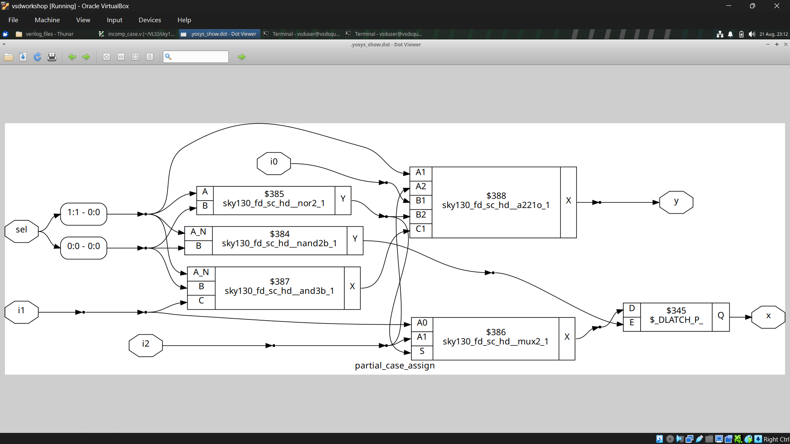
</p>

**Learning:** Every output must be assigned correctly in every execution path.

---

# Lab 6: Overlapping CASE Statements

## `casez` and Wildcards

**File:** `bad_case.v`

```verilog
always @(*) begin
    casez (sel)
        2'b00: y = i0;
        2'b01: y = i1;
        2'b10: y = i2;
        2'b1?: y = i3;
    endcase
end
```

The `?` acts as a wildcard.

```text
2'b1?
```

can match:

```text
2'b10
2'b11
```

Therefore, `2'b10` matches both `2'b10` and `2'b1?`.

| `sel`   | Matching patterns |
| ------- | ----------------- |
| `2'b00` | `2'b00`           |
| `2'b01` | `2'b01`           |
| `2'b10` | `2'b10`, `2'b1?`  |
| `2'b11` | `2'b1?`           |

This is an **overlap problem**, not a latch problem.

Wildcard conditions should be written carefully to avoid unintended selection or priority behavior.

### Waveform

<p align="center">

</p>

**Learning:** Overlapping wildcard patterns can make RTL behavior ambiguous and harder to verify.

---

# Redundancy Optimization During Synthesis

Synthesis tools optimize RTL before mapping it to the target technology.

For example:

```text
F = A + A'B
```

can be simplified to:

```text
F = A + B
```

This removes redundant logic while preserving functionality.

### Benefits

* Lower gate count
* Reduced area
* Lower logic complexity
* Improved timing
* Potential power savings

### Synthesis Flow

```text
RTL
 ↓
Logic Analysis
 ↓
Boolean Optimization
 ↓
Technology Mapping
 ↓
Gate-Level Netlist
```

The synthesized netlist may look different from the RTL while implementing the same function.

---

# Looping Constructs in Verilog

Loops describe repetitive operations without writing the same RTL repeatedly.

The two important forms are:

* Procedural `for` loop
* Generate `for` loop

## Procedural `for` Loop

Used inside an `always` block.

```verilog
integer i;

always @(*) begin
    for (i = 0; i < 4; i = i + 1) begin
        y[i] = a[i];
    end
end
```

Useful for:

* MUX
* DEMUX
* Bit-wise operations
* Array processing
* Repetitive combinational logic

The synthesis tool can unroll the loop into the required hardware.

## Generate `for` Loop

Used to create repeated structural hardware.

```verilog
genvar i;

generate
    for (i = 0; i < WIDTH; i = i + 1) begin
        // Repeated hardware
    end
endgenerate
```

Useful for:

* Ripple Carry Adders
* Full Adder arrays
* Register arrays
* Repeated module instances
* Parameterized designs

### Procedural FOR vs Generate FOR

| Feature     | Procedural `for`       | Generate `for`            |
| ----------- | ---------------------- | ------------------------- |
| Location    | Inside `always`        | Outside procedural blocks |
| Purpose     | Repeats RTL operations | Replicates hardware       |
| Typical use | MUX, DEMUX             | RCA, module arrays        |
| Variable    | Usually `integer`      | `genvar`                  |
| Stage       | Procedural evaluation  | Elaboration               |

---

# Labs 7–10: Loop-Based MUX, DEMUX, and RCA

## Lab 7 – MUX Using Procedural `for`

**File:** `mux_generate.v`

A MUX selects one input from multiple inputs according to a select signal.

```text
Multiple Inputs
      ↓
 Select Signal
      ↓
     MUX
      ↓
 Single Output
```

A loop-based implementation reduces repetitive RTL and improves scalability.

### Waveform

<p align="center">
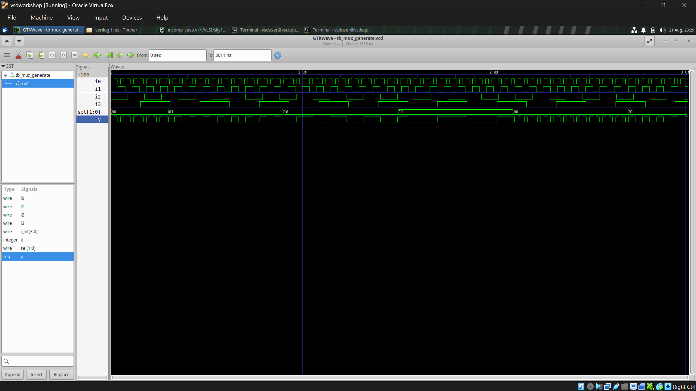
</p>

**Learning:** Procedural loops can provide compact and scalable MUX logic.

---

## Lab 8 – DEMUX Using CASE

**File:** `demux_case.v`

A DEMUX routes one input to one of several outputs according to the select signal.

For a 4-output DEMUX:

```text
sel = 00 → Output 0
sel = 01 → Output 1
sel = 10 → Output 2
sel = 11 → Output 3
```

A `case` statement directly represents these conditions.

### Waveform

<p align="center">
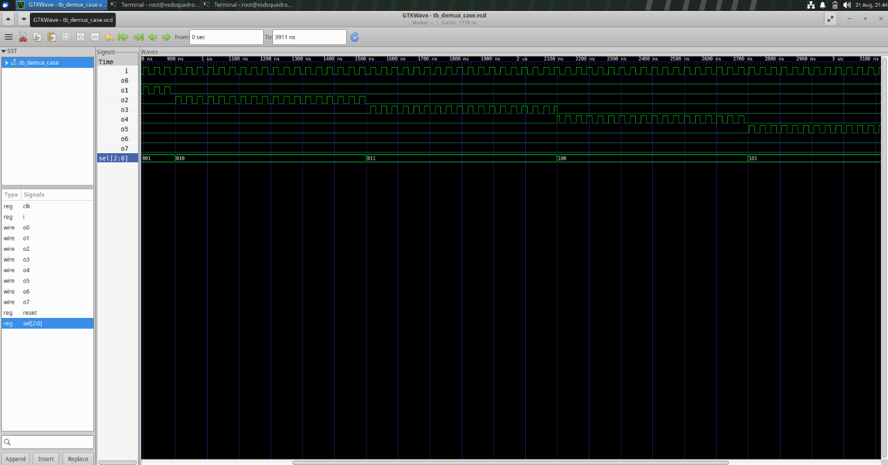
</p>

**Learning:** `case` provides a simple and readable DEMUX implementation.

---

## Lab 9 – DEMUX Using Procedural `for`

**File:** `demux_generate.v`

General operation:

```text
Initialize outputs
      ↓
Read select signal
      ↓
Iterate through outputs
      ↓
Find selected output
      ↓
Activate selected output
```

### CASE vs Procedural LOOP

| Feature       | CASE              | Procedural `for`   |
| ------------- | ----------------- | ------------------ |
| Approach      | Explicit branches | Repeated operation |
| Small designs | Simple            | Simple             |
| Scalability   | More manual       | More convenient    |
| Repetition    | Higher            | Lower              |

### Waveform

<p align="center">
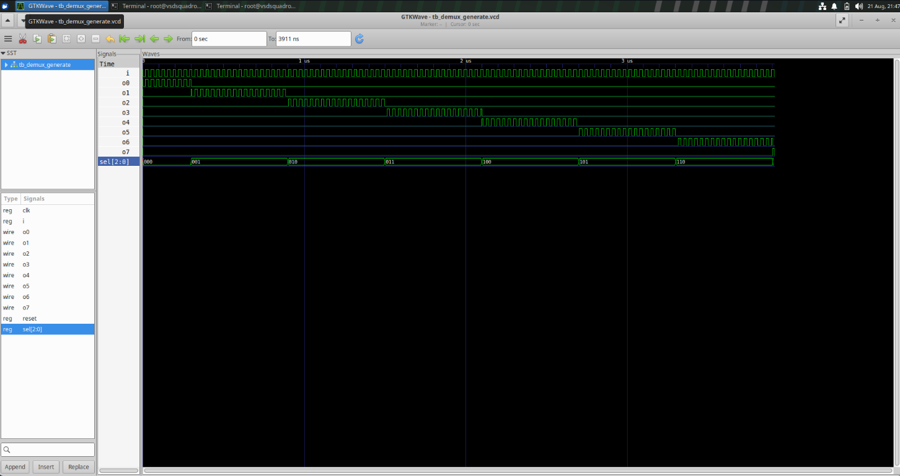
</p>

**Learning:** A procedural loop provides a compact and scalable DEMUX description.

---

# Lab 10 – Ripple Carry Adder Using Generate `for`

**File:** `rca.v`

An RCA is built by connecting multiple Full Adders.

Each Full Adder receives:

* `A` bit
* `B` bit
* Carry from the previous stage

and produces:

* Sum bit
* Carry for the next stage

The carry propagates from the **LSB to the MSB**.

```text
A0 ──┐
B0 ──┤
Cin ─┤
     ↓
 Full Adder
     │
     ├── Sum0
     └── Carry1
            ↓
        Full Adder
            │
            ├── Sum1
            └── Carry2
                   ↓
                  ...
```

### Generate Loop

```verilog
genvar i;

generate
    for (i = 0; i < WIDTH; i = i + 1) begin

        full_adder FA (
            .a(a[i]),
            .b(b[i]),
            .cin(carry[i]),
            .sum(sum[i]),
            .cout(carry[i+1])
        );

    end
endgenerate
```

The generate loop creates one Full Adder for every bit, making the RCA scalable by changing `WIDTH`.

### RTL Simulation Waveform

<p align="center">
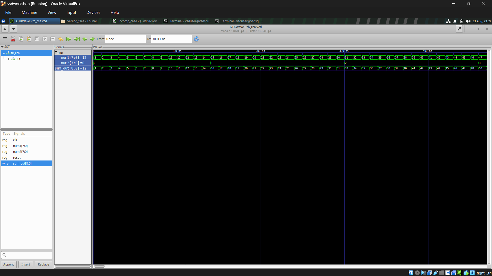
</p>

The waveform verifies the addition operation, sum, and carry behavior.

### Synthesized Netlist

<!-- Add synthesized RCA netlist image here -->

The synthesized netlist shows the hardware generated from the RTL.

### Gate-Level Verification

The RTL and synthesized implementation can be compared using **Gate-Level Simulation (GLS)** to verify that synthesis preserved the intended functionality.

**Learning:** Generate loops are useful for repeated structural hardware such as RCAs, register arrays, and parameterized designs.

---

# Overall Summary

| Topic                  | Main Learning                         |
| ---------------------- | ------------------------------------- |
| IF-ELSE                | Priority-based conditions             |
| CASE                   | Multi-way selection                   |
| Incomplete IF          | Can infer latches                     |
| Incomplete CASE        | Can infer latches                     |
| Partial assignment     | Can cause storage for an output       |
| `casez`                | Supports wildcard matching            |
| Overlapping CASE       | Can cause multiple matches            |
| Synthesis optimization | Removes redundant logic               |
| Procedural `for`       | Repeats RTL operations                |
| Generate `for`         | Creates repeated hardware             |
| MUX                    | Selects one input                     |
| DEMUX                  | Routes one input                      |
| RCA                    | Adds binary numbers using Full Adders |
| Simulation             | Verifies functionality                |
| Synthesis              | Converts RTL to hardware              |
| GLS                    | Verifies synthesized hardware         |

---

## Conclusion

Day 5 focuses on writing **complete, clear, and synthesis-friendly RTL**.

The incomplete `if-else` and `case` experiments show how missing assignments can cause unintended latches. The complete versions demonstrate how full assignment coverage avoids this problem. The partial assignment experiment shows that each output must be checked independently.

The `casez` experiment demonstrates the importance of avoiding unintended wildcard overlaps. Synthesis optimization shows how redundant logic can be removed while preserving functionality.

Finally, procedural and generate `for` loops demonstrate how repetitive hardware can be described compactly. The MUX and DEMUX experiments apply loops and `case` statements to selection and routing logic, while the RCA demonstrates how a generate loop can create repeated Full Adder hardware.

Overall, the experiments provide practical experience in **conditional RTL coding, latch avoidance, synthesis optimization, looping constructs, simulation, and structural hardware generation**.
