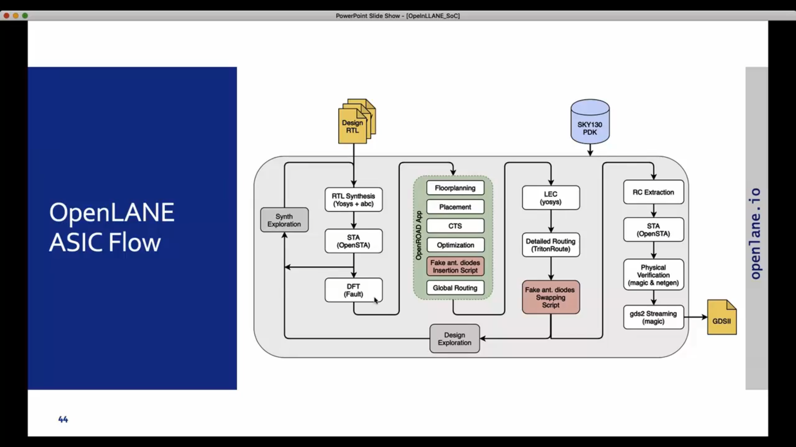

# Day 6 – Open-Source EDA, OpenLane and RTL-to-GDSII Flow

Day 6 focuses on the complete **ASIC design flow**, starting from RTL design and ending with the final **GDSII layout**. The session covers Open-Source EDA tools, OpenLane, semiconductor foundries, PDKs, SkyWater Technology, the SKY130 130nm technology, PicoRV32, and the complete RTL-to-GDSII implementation flow.

---

## 1. Open-Source EDA

**EDA (Electronic Design Automation)** refers to software tools used for designing, simulating, synthesizing, verifying, and physically implementing electronic circuits and integrated circuits.

Traditional ASIC design flows rely heavily on proprietary commercial EDA tools. Open-source EDA provides freely accessible alternatives that allow students, researchers, and developers to understand and experiment with the complete semiconductor design process.

### Major Open-Source EDA Tools

| Tool | Purpose |
|---|---|
| Yosys | RTL synthesis |
| ABC | Logic optimization and technology mapping |
| OpenSTA | Static Timing Analysis |
| OpenROAD | Physical design |
| TritonRoute | Detailed routing |
| Magic | Layout, DRC and physical verification |
| Netgen | LVS |
| KLayout | Layout viewing and analysis |
| Fault | Design-for-Test related operations |

These tools can be combined to create a complete open-source ASIC design flow.

---

## 2. Semiconductor Foundry

A **semiconductor foundry** is a company that manufactures integrated circuits according to a chip designer's physical design.

The designer creates the circuit and generates the required physical layout, while the foundry provides the manufacturing technology and design information required to produce the chip.

### Basic Relationship

```text
Chip Designer
     |
     v
RTL Design
     |
     v
EDA Flow
     |
     v
Physical Layout
     |
     v
GDSII
     |
     v
Semiconductor Foundry
     |
     v
Manufactured Chip
```

The foundry's process determines important characteristics such as:

- Transistor technology
- Metal layers
- Design rules
- Standard cells
- Operating voltages
- Manufacturing constraints
- Process-specific device models

---

## 3. Process Design Kit (PDK)

**PDK stands for Process Design Kit.**

A PDK provides the technology-specific information required by EDA tools to design and verify a chip for a particular manufacturing process.

The PDK acts as the interface between the **EDA design flow and the semiconductor manufacturing process**.

### Typical PDK Contents

- Technology files
- Standard-cell libraries
- Timing libraries
- LEF files
- GDS files
- SPICE models
- Design-rule information
- DRC rules
- LVS information
- RC extraction information
- I/O cell information

The PDK allows the EDA tools to understand the physical and electrical characteristics of the target manufacturing technology.

```text
RTL
 |
 +---- EDA Tools
 |
 +---- PDK
       |
       v
Technology-Specific Design
       |
       v
GDSII
```

---

## 4. SkyWater Technology

**SkyWater Technology** is a semiconductor foundry that, together with Google, made the SKY130 process technology available through an open-source PDK.

The availability of the SKY130 PDK made it possible to study and experiment with a realistic ASIC technology using an open-source design flow.

This is particularly useful for:

- Education
- Research
- ASIC design experiments
- Open-source silicon projects
- Digital and mixed-signal design
- Learning physical design

---

## 5. SKY130 – 130nm Technology

**SKY130** refers to the SkyWater 130nm-class semiconductor process technology.

It is a mature technology node that is suitable for learning the complete ASIC design flow.

The SKY130 PDK provides technology files, standard-cell libraries, models, and other resources required by the EDA tools.

### Why SKY130 is Useful

- Mature and well-understood technology
- Open-source PDK availability
- Suitable for educational projects
- Supports digital ASIC design
- Can be used with open-source EDA tools
- Allows study of a complete RTL-to-GDSII flow

Although modern commercial processors use much smaller technology nodes, 130nm remains valuable for understanding ASIC design because the complete technology and design flow can be studied openly.

> **Note:** 130nm is a process-node classification and does not mean that every physical feature in the technology is exactly 130nm.

---

## 6. OpenLane

**OpenLane** is an open-source automated ASIC implementation flow.

It combines multiple open-source EDA tools to convert a digital RTL design into a physical layout.

The overall objective is:

```text
RTL
 |
 v
Synthesis
 |
 v
Gate-Level Netlist
 |
 v
Floorplanning
 |
 v
Placement
 |
 v
Clock Tree Synthesis
 |
 v
Routing
 |
 v
Physical Verification
 |
 v
GDSII
```

OpenLane automates many of the individual steps that would otherwise have to be performed manually.

---

## 7. PicoRV32

**PicoRV32** is a small and size-optimized RISC-V processor core developed by Clifford Wolf.

It implements the RISC-V RV32 instruction-set architecture and is designed to provide a compact processor implementation.

PicoRV32 is useful for ASIC flow experiments because it is a practical RTL design containing considerably more logic than simple examples such as counters or multiplexers.

### PicoRV32 Contains

- Instruction decoding
- Registers
- Arithmetic and logic operations
- Control logic
- Sequential logic
- Combinational logic
- Memory interface
- RISC-V processor functionality

Using PicoRV32 demonstrates how a real processor design can progress through synthesis and physical implementation.

---

# 8. RTL-to-GDSII Flow

The complete ASIC implementation flow converts an RTL description into a physical layout.

The major stages are:

```text
RTL Design
    |
    v
RTL Synthesis
(Yosys + ABC)
    |
    v
Gate-Level Netlist
    |
    v
Static Timing Analysis
(OpenSTA)
    |
    v
Floorplanning
    |
    v
Power Planning
    |
    v
Placement
    |
    v
Clock Tree Synthesis
(CTS)
    |
    v
Optimization
    |
    v
Global Routing
    |
    v
Detailed Routing
    |
    v
RC Extraction
    |
    v
Post-Route STA
    |
    v
Physical Verification
(DRC + LVS)
    |
    v
GDSII
```

---

## 9. RTL Design

**RTL stands for Register Transfer Level.**

RTL describes the behavior and structure of a digital circuit using a hardware description language such as:

- Verilog
- SystemVerilog
- VHDL

For example:

```verilog
always @(posedge clk)
    q <= d;
```

describes a register that stores the value of `d` on the active clock edge.

RTL focuses on the required hardware behavior rather than its final physical geometry.

---

## 10. RTL Synthesis

The first major implementation step is converting RTL into a **gate-level netlist**.

OpenLane uses tools such as **Yosys and ABC** during synthesis.

### Synthesis Flow

```text
Verilog RTL
     |
     v
   Yosys
     |
     v
Synthesized Logic
     |
     v
    ABC
     |
     v
Technology Mapping
     |
     v
SKY130 Standard Cells
     |
     v
Gate-Level Netlist
```

### Yosys

Yosys performs RTL synthesis and converts the behavioral RTL into a structural representation.

### ABC

ABC performs logic optimization and technology mapping.

It maps the logic to cells available in the target technology library.

Examples of standard cells include:

- AND gates
- OR gates
- NAND gates
- NOR gates
- Inverters
- Buffers
- Multiplexers
- Flip-flops

---

## 11. Static Timing Analysis (STA)

**STA stands for Static Timing Analysis.**

STA checks whether signals can propagate through the circuit within the required timing constraints.

OpenSTA is used for timing analysis in the OpenLane flow.

Important timing parameters include:

### WNS – Worst Negative Slack

WNS represents the worst timing slack among the analyzed timing paths.

```text
WNS >= 0
```

generally indicates that the corresponding timing requirement is satisfied.

### TNS – Total Negative Slack

TNS represents the total amount of negative slack across violating timing paths.

```text
TNS = 0
```

generally indicates that there are no negative-slack paths for the analyzed timing category.

### Other Important Timing Parameters

- Clock period
- Data arrival time
- Data required time
- Slack
- Critical path
- Setup violations
- Hold violations

---

## 12. Floorplanning

Floorplanning determines the physical organization of the chip.

It defines the approximate:

- Die area
- Core area
- Standard-cell region
- I/O locations
- Power distribution structure

A simplified floorplan can be represented as:

```text
+--------------------------------+
|              DIE               |
|                                |
|     +----------------------+    |
|     |        CORE         |    |
|     |                     |    |
|     |   Standard Cells   |    |
|     |                     |    |
|     +----------------------+    |
|                                |
+--------------------------------+
```

A good floorplan helps improve:

- Timing
- Area utilization
- Routing
- Congestion
- Power distribution

---

## 13. Power Planning

Power planning creates a network to distribute power and ground throughout the design.

The power distribution network can include:

- Power rings
- Power straps
- Power rails
- VDD connections
- VSS connections

```text
VDD
 |
 +---- Power Ring
 |
 +---- Power Straps
 |
 +---- Standard Cells
```

A proper power network helps maintain a stable supply and reduces issues such as excessive IR drop.

---

## 14. Placement

Placement determines the physical locations of standard cells within the core.

### Global Placement

Global placement determines approximate locations for the cells while trying to optimize the overall design.

### Detailed Placement

Detailed placement moves cells into legal physical locations while satisfying placement constraints.

Placement attempts to optimize:

- Wire length
- Timing
- Congestion
- Area utilization

---

## 15. Clock Tree Synthesis (CTS)

Sequential circuits require a clock signal to reach many flip-flops.

If the clock reaches different flip-flops at significantly different times, **clock skew** can occur.

Clock Tree Synthesis creates a clock distribution network using buffers and other clock elements.

```text
              CLOCK
                |
              Buffer
             /      \
        Buffer      Buffer
        /   \        /   \
       FF   FF      FF   FF
```

CTS attempts to control:

- Clock skew
- Clock delay
- Fanout
- Clock transition

---

## 16. Routing

Routing connects the placed standard cells using the available metal layers.

Routing generally consists of two major stages.

### Global Routing

Global routing determines approximate paths between connected cells.

### Detailed Routing

Detailed routing creates the actual physical wires and vias while following the technology design rules.

The routing process must consider:

- Metal layers
- Wire spacing
- Wire width
- Via placement
- Congestion
- Timing

---

## 17. RC Extraction

Physical wires have electrical resistance and capacitance.

These parasitic effects introduce additional signal delay.

RC extraction determines the parasitic resistance and capacitance associated with the routed design.

```text
Routed Layout
      |
      v
RC Extraction
      |
      v
Parasitic Information
      |
      v
Post-Route STA
```

This allows timing analysis to account for the effects of the actual physical interconnect.

---

## 18. Post-Route Static Timing Analysis

After routing, timing analysis is performed again.

This stage is important because the physical wires introduce additional delay that may not be accurately represented during early stages.

Post-route STA can provide:

- WNS
- TNS
- Critical paths
- Setup timing
- Hold timing
- Data arrival time
- Data required time
- Slack

The timing results after routing provide a more realistic representation of the final physical implementation.

---

## 19. Physical Verification

After routing, the physical layout must be verified before it can be considered ready for manufacturing.

### DRC – Design Rule Check

DRC checks whether the layout follows the manufacturing rules of the target technology.

Examples include:

- Minimum metal width
- Minimum spacing
- Via rules
- Layer restrictions
- Geometrical constraints

### LVS – Layout Versus Schematic

LVS checks whether the physical layout corresponds to the intended circuit/netlist.

```text
Gate-Level Netlist
        |
        | Compare
        v
Physical Layout
        |
        v
     LVS Result
```

Open-source tools such as **Magic** and **Netgen** can be used for physical verification.

---

## 20. GDSII Generation

After successful physical implementation and verification, the final physical layout is exported as a **GDSII** file.

GDSII is a standard file format used to represent the physical geometry of an integrated circuit.

It contains information about:

- Physical shapes
- Layout layers
- Cells
- Geometries
- Interconnect structures

The final output can be represented as:

```text
RTL
 |
 v
Synthesis
 |
 v
Floorplan
 |
 v
Placement
 |
 v
CTS
 |
 v
Routing
 |
 v
Physical Verification
 |
 v
GDSII
 |
 v
Tapeout
 |
 v
Fabrication
```

---

# 21. Main Tools Used in the Flow

| Design Stage | Tool | Main Function |
|---|---|---|
| RTL Synthesis | Yosys | RTL synthesis |
| Logic Optimization | ABC | Logic optimization and technology mapping |
| Static Timing Analysis | OpenSTA | Timing analysis |
| Physical Design | OpenROAD | Floorplanning, placement and physical implementation |
| Clock Tree Synthesis | OpenROAD / CTS tools | Clock distribution |
| Global Routing | OpenROAD | Global routing |
| Detailed Routing | TritonRoute | Detailed routing |
| RC Extraction | OpenRCX / extraction tools | Parasitic extraction |
| DRC | Magic | Design-rule checking |
| LVS | Netgen | Layout-versus-netlist checking |
| Layout Viewing | KLayout / Magic | Physical layout visualization |
| Final Output | GDSII | Physical IC layout |

---

# 22. OpenLane ASIC Flow

The complete OpenLane flow can be summarized as:

```text
                    +-------------+
                    |  RTL Design |
                    +------+------+
                           |
                           v
                    +-------------+
                    |    Yosys    |
                    |  Synthesis  |
                    +------+------+
                           |
                           v
                    +-------------+
                    |     ABC     |
                    | Optimization|
                    +------+------+
                           |
                           v
                    +-------------+
                    |   OpenSTA   |
                    |     STA     |
                    +------+------+
                           |
                           v
                    +-------------+
                    |Floorplanning|
                    +------+------+
                           |
                           v
                    +-------------+
                    |  Placement  |
                    +------+------+
                           |
                           v
                    +-------------+
                    |     CTS     |
                    +------+------+
                           |
                           v
                    +-------------+
                    |   Routing   |
                    +------+------+
                           |
                           v
                    +-------------+
                    | RC Extraction|
                    +------+------+
                           |
                           v
                    +-------------+
                    | Post-Route  |
                    |     STA     |
                    +------+------+
                           |
                           v
                    +-------------+
                    |  DRC / LVS  |
                    +------+------+
                           |
                           v
                    +-------------+
                    |    GDSII    |
                    +-------------+
```

---

# 23. Important Concepts Learned

Through this experiment, the following concepts were studied:

- Electronic Design Automation (EDA)
- Open-source EDA tools
- Semiconductor foundries
- Process Design Kits (PDKs)
- SkyWater Technology
- SKY130 technology
- 130nm process technology
- OpenLane
- PicoRV32 RISC-V processor
- Technology mapping
- Static Timing Analysis
- WNS and TNS
- Floorplanning
- Power planning
- Placement
- Clock Tree Synthesis
- Global routing
- Detailed routing
- Post-route timing analysis
- DRC
- LVS
- GDSII generation
- Complete RTL-to-GDSII flow

---


# 24. Conclusion

Day 6 demonstrated the complete **RTL-to-GDSII ASIC design flow** using open-source EDA tools, OpenLane, and the SkyWater SKY130 PDK. The flow showed how a design such as PicoRV32 can be synthesized, optimized, physically implemented, timed, verified, and finally converted into a GDSII layout.

The experiment provided an understanding of how RTL code is transformed into actual physical structures such as standard cells, clock networks, metal interconnects, and vias, connecting digital design concepts with real semiconductor physical implementation.



---
