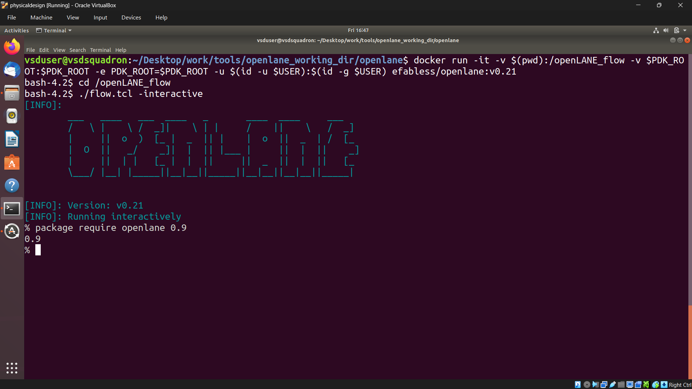
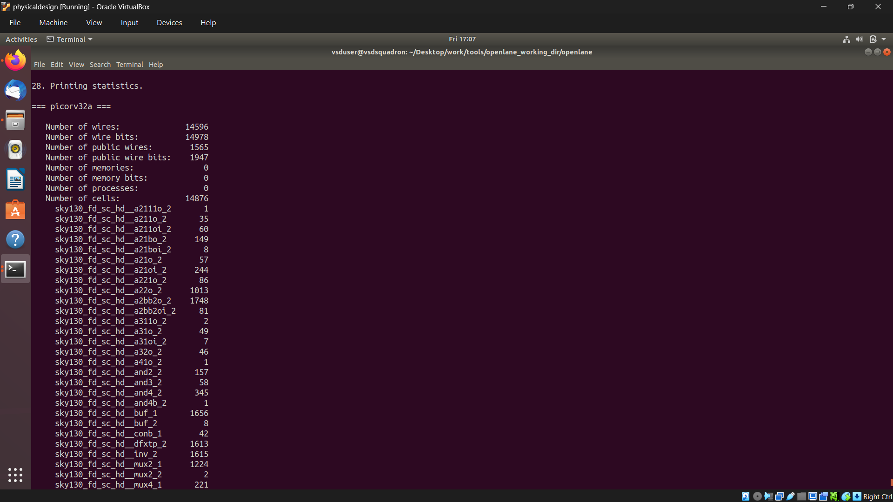
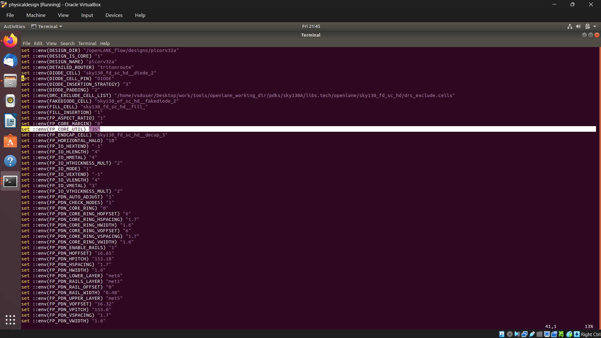
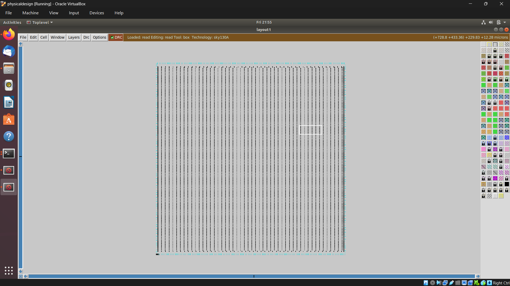
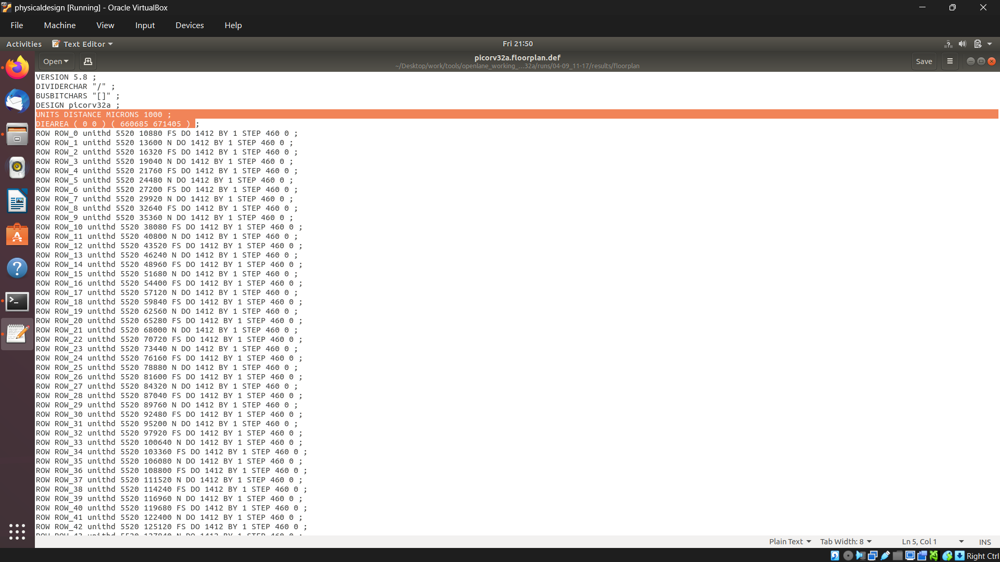
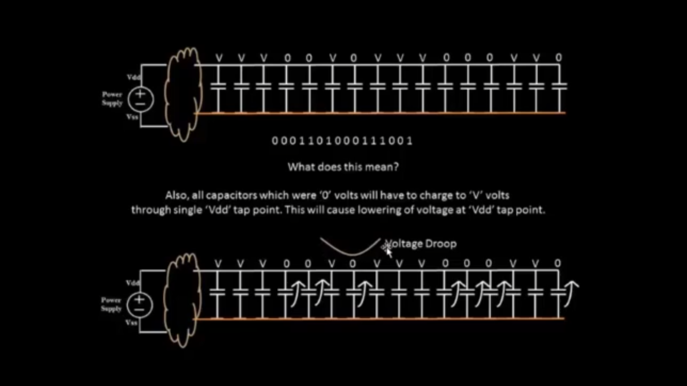
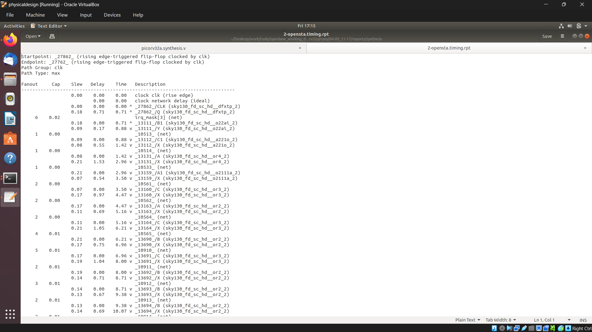
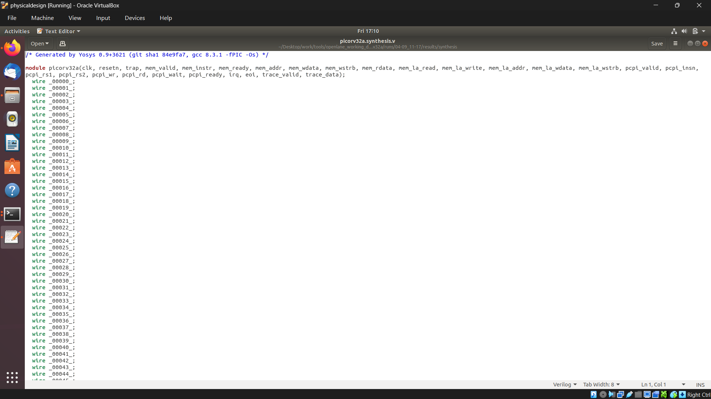

# Day 7 – OpenLane Physical Design: Core, Die, Floorplan, Placement and Power Distribution

## VSD – RTL to GDSII Workshop

Day 7 of the VSD workshop focused on the **physical design stage of the RTL-to-GDSII flow** using **OpenLane**, the **SKY130 PDK**, and **Magic**.

The main concepts covered during this session were:

- Core and Die
- Floorplanning
- Aspect Ratio
- Core Utilization
- Standard Cell Placement
- Power Distribution Network (PDN)
- Power Meshes
- Supply Lines
- Decoupling Capacitors
- Timing Analysis
- Physical Verification
- Viewing the physical layout using Magic

The practical work involved running OpenLane step-by-step, generating the synthesis, floorplan and placement outputs, and then opening the generated DEF layout using Magic.

---

# 1. RTL to GDSII Physical Design Flow

The overall RTL-to-GDSII flow can be represented as:

```text
RTL
 │
 ▼
Synthesis
 │
 ▼
Floorplanning
 │
 ▼
Placement
 │
 ▼
Power Distribution Network
 │
 ▼
Clock Tree Synthesis
 │
 ▼
Routing
 │
 ▼
Physical Verification
 │
 ▼
GDSII
````

In this Day 7 exercise, the main focus was on **synthesis, floorplanning and placement**, along with understanding the physical organization of the chip and how power is distributed across the design.

The transition can be understood as:

```text
RTL Design
    ↓
Logical/Gate-Level Netlist
    ↓
Floorplan
    ↓
Placed Standard Cells
    ↓
Power Distribution
    ↓
Routing
    ↓
Verified Physical Layout
    ↓
GDSII
```

---

# 2. OpenLane Environment Setup

The OpenLane working directory was first accessed from the terminal.

### Command used

```bash
cd ~/Desktop/work/tools/openlane_working_dir/openlane
```

This command moves into the OpenLane working directory where the OpenLane flow scripts and design files are available.

The PDK environment variable was then checked using:

```bash
echo $PDK_ROOT
```

`PDK_ROOT` is an environment variable that points to the location of the installed Process Design Kit.

The Docker alias was removed using:

```bash
unalias docker
```

OpenLane was then launched using the following Docker command:

```bash
docker run -it -v $(pwd):/openLANE_flow -v $PDK_ROOT:$PDK_ROOT -e PDK_ROOT=$PDK_ROOT -u $(id -u $USER):$(id -g $USER) efabless/openlane:v0.21
```

This starts the **OpenLane v0.21 Docker environment**.

The command also mounts:

* The current OpenLane working directory
* The PDK directory
* The `PDK_ROOT` environment variable

into the Docker container.

This allows OpenLane inside the container to access the required design files and SKY130 PDK files.

---

# 3. Starting OpenLane in Interactive Mode



After entering the Docker container, the OpenLane flow directory was accessed using:

```bash
cd /openLANE_flow
```

OpenLane was then started in interactive mode:

```bash
./flow.tcl -interactive
```

Interactive mode allows individual stages of the OpenLane flow to be executed manually.

Instead of executing the entire RTL-to-GDSII flow at once, each stage can be run separately and its output can be inspected.

The design was prepared using:

```tcl
prep -design <YOUR_DESIGN>
```

The `prep` command prepares the selected design for the OpenLane flow.

It loads the required:

* RTL files
* Design configuration
* PDK information
* Standard-cell libraries
* Timing information
* Other required files

---

# 4. Synthesis

The synthesis stage was executed using:

```tcl
run_synthesis
```

Synthesis converts the RTL description into a **gate-level netlist** using cells from the selected standard-cell library.

For example, RTL constructs such as:

```text
if
case
always blocks
registers
arithmetic operations
logic expressions
```

are converted into actual hardware cells such as:

* AND gates
* OR gates
* Multiplexers
* Flip-flops
* Buffers
* Inverters
* Other standard cells

The synthesized netlist is then used as the input for the physical-design stages.

---

# 5. Flip Flop Percentage
The synthesis results were also used to determine the percentage of sequential cells.



The number of flip-flops was:

1613

The total number of cells was:

14876

Therefore:

Flip-Flop Percentage
= (1613 / 14876) × 100
= 10.84%

So approximately 10.84% of the total cells are flip-flops.

This gives an idea of how much of the synthesized design consists of sequential logic compared with the total number of cells.

The remaining cells are mainly combinational and other supporting cells.

The flip-flop percentage is useful because it gives an idea about the sequential nature of the design and the amount of state-holding logic present in the synthesized circuit.

---

# 6. Floorplanning

After synthesis, the floorplan was generated using:

```tcl
run_floorplan
```

Floorplanning is the stage where the basic physical organization of the chip is established.

It determines important physical parameters such as:

* Die dimensions
* Core dimensions
* Core utilization
* Aspect ratio
* Core margins
* Placement area
* Space available for routing
* Space required for power distribution

The floorplan becomes the foundation for the later placement and routing stages.

A poor floorplan can result in:

* High routing congestion
* Long interconnects
* Timing problems
* Difficult power distribution
* Poor utilization of silicon area

Therefore, floorplanning is one of the most important physical-design stages.

---

# 7. Core Utilization

The core utilization was set to:

```text
FP_CORE_UTIL = 35
```

Therefore, the core utilization was:

```text
35%
```

Core utilization represents the percentage of the available core area targeted to be occupied by standard cells.

The basic relationship is:

```text
Core Utilization =
Area occupied by standard cells
-------------------------------- × 100
       Available core area
```

A utilization of **35%** means that the standard cells are not packed tightly across the entire available core area.

The remaining whitespace is useful for:

* Routing
* Power distribution
* Clock-tree components
* Buffers
* Decoupling capacitors
* Placement optimization
* Reducing routing congestion

If the utilization is too high, the cells become densely packed.

This can make routing difficult because there may not be enough space for the required metal connections.

Therefore, selecting a suitable utilization is an important part of floorplan design.

---

# 8. Core Utilization Screenshot

### Image: `35util.png`



The above screenshot shows the floorplan configuration/output corresponding to the **35% core utilization**.

The value of:

```text
FP_CORE_UTIL = 35
```

was used during the floorplanning stage.

This gives the placer sufficient whitespace to arrange the standard cells and also provides room for routing and power structures.

---

# 9. Aspect Ratio

The aspect ratio used during floorplanning was:

```text
Aspect Ratio = 1
```

Aspect ratio is defined as:

```text
Aspect Ratio = Width / Height
```

Therefore:

```text
Aspect Ratio = 1
```

means that the width and height are approximately equal.

The resulting floorplan is therefore approximately square.

A simplified representation is:

```text
              Width
        <---------------->

        +------------------+
        |                  |
        |                  |
        |       CORE       |
Height  |                  |
        |                  |
        |                  |
        +------------------+
```

An aspect ratio of 1 is useful when there is no specific requirement for the design to be longer in one direction.

The aspect ratio directly affects the physical shape of the core and therefore also affects placement, routing and the overall die dimensions.

---

# 10. Core and Die

Two important terms in physical design are **core** and **die**.

## Die

The **die** represents the complete physical silicon area of the chip.

It can contain:

* Core
* I/O regions
* Power structures
* Standard cells
* Routing
* Other physical structures

## Core

The **core** is the main internal region where the standard cells are placed.

A simplified representation is:

```text
+------------------------------------------+
|                  DIE                     |
|                                          |
|       +--------------------------+       |
|       |                          |       |
|       |           CORE           |       |
|       |                          |       |
|       |    Standard Cells        |       |
|       |    Routing              |       |
|       |    Power Distribution   |       |
|       |                          |       |
|       +--------------------------+       |
|                                          |
+------------------------------------------+
```

The core does not occupy the entire die.

There is space between the core and the die boundary because physical implementation requires room for power structures, I/O-related structures and other design requirements.

---


# 11. Die Area Calculation

The generated DEF contains the following information:

```text
UNITS DISTANCE MICRONS 1000 ;
DIEAREA ( 0 0 ) ( 660805 671405 )
```

The important information here is:

```text
1000 database units = 1 micron
```

Therefore, the die width is:

```text
Width = 660805 / 1000
      = 660.805 µm
```

The die height is:

```text
Height = 671405 / 1000
       = 671.405 µm
```

Therefore:

```text
Area = Width × Height

     = 660.805 × 671.405

     = 443667.78 µm²
```

### Die Area

```text
443,667.78 µm²
```

### Area Calculation

```text
Area = __________________________________________
```

> **Note:** The area above is in square microns. Since `1 mm² = 1,000,000 µm²`, the equivalent area is approximately **0.44367 mm²**.

---

# 12. Floorplan Screenshot

### Image: `floorplan.png`



The screenshot shows the generated floorplan after running:

```tcl
run_floorplan
```

The floorplan provides a physical representation of the die and core.

It shows how the available area is organized before the standard cells are physically placed.

The floorplan is important because it determines the physical region available for:

* Standard cells
* Routing
* Power distribution
* Clock distribution
* Other physical structures

---

# 13. Area Information Screenshot

### Image: `area.png`



The screenshot shows the area-related information obtained from the physical-design output.

The DEF information:

```text
UNITS DISTANCE MICRONS 1000 ;
DIEAREA ( 0 0 ) ( 660805 671405 )
```

allows the physical die dimensions to be calculated.

Since the DEF uses database units, the coordinates must first be converted into microns before calculating the physical area.

The resulting dimensions are:

```text
Width  = 660.805 µm
Height = 671.405 µm
```

and the die area is:

```text
443,667.78 µm²
```

---

# 14. Placement

After generating the floorplan, standard-cell placement was performed using:

```tcl
run_placement
```

Placement determines the physical location of the standard cells inside the core.

Before placement, the synthesized netlist contains the logical relationships between cells.

After placement, every standard cell is assigned a physical location.

The transition can be represented as:

```text
Synthesized Netlist
        │
        ▼
 Standard Cells
        │
        ▼
Physical X,Y Locations
```

The placement process considers factors such as:

* Cell density
* Timing
* Wirelength
* Routing congestion
* Power
* Connectivity

Good placement is important because the positions of cells affect the length of the wires that will later connect them.

Poor placement can result in:

* Longer wires
* Increased delay
* Routing congestion
* Timing violations
* Difficult routing

---

# 15. Placement Screenshot

### Image: `placement.png`


The screenshot shows the standard cells physically placed inside the core.

The cells are arranged in standard-cell rows.

The whitespace between cells is important because it provides room for routing and other physical structures.

The placement stage therefore converts the floorplan from an area containing mainly boundaries and rows into a physical arrangement containing the actual cells of the synthesized design.

---

# 16. Viewing the Floorplan and Placement Using Magic

After generating the floorplan and placement, the physical layout was opened using **Magic**.

The exact command used was:

```bash
magic -T /home/vsduser/Desktop/work/tools/openlane_working_dir/pdks/sky130A/libs.tech/magic/sky130A.tech lef read ../../tmp/merged.lef lef def read picorv32a.floorplan.def &
```

This command loads the required SKY130 technology information and reads the LEF and DEF files.

### `magic`

Starts the Magic VLSI layout tool.

### `-T`

Specifies the technology file.

The technology file used was:

```text
sky130A.tech
```

This provides Magic with the technology-specific information required to correctly interpret the layout.

### `lef read ../../tmp/merged.lef`

Reads the merged LEF file.

LEF provides the physical abstracts of the cells and other layout information such as:

* Cell dimensions
* Pin locations
* Metal layers
* Routing information
* Cell abstracts

### `lef def read picorv32a.floorplan.def`

Reads the generated DEF file.

DEF contains physical implementation information such as:

* Die area
* Cell locations
* Components
* Nets
* Coordinates

The `&` at the end runs the Magic command in the background.

---

# 17. Why Is a Power Distribution Network Needed?

Every standard cell in the design requires a stable power supply.

The two main supply connections are:

```text
VDD
GND
```

Power cannot simply be supplied to a single point and expected to reach every cell without any voltage loss.

The metal wires used for power distribution have resistance.

When current flows through the resistance, a voltage drop occurs.

The basic relationship is:

```text
Voltage Drop = Current × Resistance
```

This voltage drop is commonly referred to as **IR drop**.

If the power distribution network is poorly designed, cells that are farther away from the power source may experience a larger voltage drop.

This can affect the reliability and correct operation of the circuit.

Therefore, a proper power distribution network is required.

---

# 18. Power Distribution Network

A **Power Distribution Network (PDN)** is used to distribute:

```text
VDD
GND
```

throughout the chip.

The PDN generally contains:

* Power rings
* Horizontal power straps
* Vertical power straps
* Standard-cell power rails

The basic structure can be represented as:

```text
              POWER SOURCE
                   │
                   ▼
              POWER RING
                   │
          ┌────────┼────────┐
          │        │        │
          │        │        │
       ═════════════════════════
          │        │        │
          │        │        │
       ═════════════════════════
          │        │        │
          │        │        │
       ═════════════════════════
                   │
                   ▼
          STANDARD CELL RAILS
                   │
                   ▼
             VDD / GND
```

The power network provides multiple paths for current to reach the cells.

---

# 19. Power Mesh

A power mesh is formed by horizontal and vertical power connections.

A simplified representation is:

```text
VDD / GND

================================================
       │        │        │        │
       │        │        │        │
================================================
       │        │        │        │
       │        │        │        │
================================================
       │        │        │        │
       │        │        │        │
================================================
```

The horizontal and vertical metal connections create multiple paths through which current can flow.

This reduces the effective resistance of the power distribution network and helps maintain a more stable supply voltage throughout the core.

A strong power mesh is especially important as the number of cells and switching activity increase.

---

# 20. Power Mesh Parameters

The power distribution network used parameters such as:

```text
Core Ring Offset       = 6
Core Ring Spacing      = 1.7
Core Ring Width        = 1.6
Lower Metal Layer      = met4
Upper Metal Layer      = met5
Rails Layer            = met1
Rail Width             = 0.48
Pitch                  = 153.18
Horizontal Spacing     = 1.7
Vertical Spacing       = 1.7
Vertical Width         = 1.6
```

These parameters determine the physical characteristics of the power distribution network.

They control factors such as:

* Power-ring dimensions
* Spacing between structures
* Width of power metal
* Metal layers used
* Distance between power straps
* Standard-cell rail dimensions

Higher metal layers such as `met4` and `met5` can be used for distributing power over larger distances, while lower metal layers such as `met1` can provide power connections to standard-cell rows.

---

# 21. Supply Lines

### Image: `supplylines.png`



The screenshot shows the power supply structures distributed through the design.

The power network connects the larger power distribution structures to the standard-cell rows.

The overall power flow can be understood as:

```text
Power Source
     │
     ▼
Power Ring
     │
     ▼
Power Mesh / Straps
     │
     ▼
Standard Cell Rails
     │
     ▼
Individual Cells
```

The multiple paths provided by the mesh help reduce the resistance of the power network and distribute power more uniformly across the core.

---

# 22. Standard-Cell Power Rails

Standard cells need direct access to:

```text
VDD
GND
```

The standard-cell rows contain power rails that connect the cells to the larger power distribution network.

The overall structure can be represented as:

```text
Higher Metal Power Mesh
          │
          ▼
     Power Straps
          │
          ▼
 Standard Cell Power Rails
          │
          ▼
       VDD / GND
          │
          ▼
    Individual Cells
```

The combination of the power mesh and standard-cell rails ensures that power can reach the cells throughout the core.

---

# 23. Decoupling Capacitors

### Image: `decouplingcap.png`


**Decoupling capacitors**, commonly called **decaps**, are used to improve the stability of the local power supply.

When many cells switch at the same time, they can suddenly demand a large amount of current.

This sudden current demand can cause a temporary disturbance in the local supply voltage.

A decoupling capacitor can act as a small local energy reservoir.

A simplified representation is:

```text
VDD ─────────────┐
                 │
               Decap
                 │
GND ─────────────┘
```

The capacitor stores electrical charge.

When a circuit suddenly requires additional current, the stored charge can temporarily support the local supply.

Decoupling capacitors therefore help reduce:

* Local voltage fluctuations
* Supply noise
* Transient voltage drops
* Effects of sudden switching activity

---

# 24. Why Are Decoupling Capacitors Needed?

Consider a large number of standard cells switching simultaneously.

The current demand can change very quickly.

The power distribution network cannot respond infinitely quickly because it contains resistance and inductance.

This can cause a temporary drop in the local supply voltage.

A decoupling capacitor placed close to the cells can provide charge locally.

Therefore:

```text
Sudden Switching Activity
          │
          ▼
   Increased Current
          │
          ▼
 Local Supply Disturbance
          │
          ▼
 Decoupling Capacitor
          │
          ▼
 Local Charge Support
```

Decaps therefore improve local power integrity.

---

# 25. Why Both Power Meshes and Decoupling Capacitors Are Needed

Power meshes and decoupling capacitors have related but different purposes.

### Power Mesh

The power mesh provides the physical network used for distributing power across the chip.

```text
Power Mesh
     ↓
Continuous Power Distribution
```

### Decoupling Capacitor

The decoupling capacitor provides local charge during short-duration current demands.

```text
Decoupling Capacitor
          ↓
Local Transient Power Support
```

Therefore:

```text
Power Mesh
    +
Decoupling Capacitors
    ↓
More Stable Power Supply
```

The power mesh handles the overall distribution of VDD and GND, while decoupling capacitors help handle sudden local changes in current demand.

---

# 26. Timing Analysis

### Image: `timingreport.png`



Timing analysis is used to determine whether signals can propagate through the circuit within the required timing constraints.

A typical timing path can be represented as:

```text
Start Point
    │
    ▼
Flip-Flop
    │
    ▼
Combinational Logic
    │
    ▼
Combinational Logic
    │
    ▼
End Point
    │
    ▼
Flip-Flop
```

A timing report contains information such as:

* Start point
* End point
* Clock
* Cell delay
* Net delay
* Arrival time
* Required time
* Slack

Slack can be represented as:

```text
Slack = Required Time - Arrival Time
```

Positive slack generally means that the timing requirement is satisfied.

Negative slack indicates a timing violation.

Timing analysis is important because physical placement changes the actual interconnect distances and therefore affects the timing of signals.

---

# 27. PicoRV32 Netlist / Physical View

### Image: `piconet.png`



The screenshot shows the PicoRV32 design represented using standard cells and their physical connections.

At the RTL level, the design is described using Verilog.

After synthesis, the RTL becomes a gate-level netlist.

After floorplanning and placement, the logical cells are assigned physical locations.

The transition can therefore be represented as:

```text
RTL
 │
 ▼
Gate-Level Netlist
 │
 ▼
Physical Standard Cells
 │
 ▼
Placement
 │
 ▼
Routing
```

This demonstrates the transition from the logical representation of the processor to its physical implementation.

---

# 28. How the Outputs / Screenshots Were Obtained / Summary

The screenshots were obtained from the outputs generated at different stages of the OpenLane physical-design flow.

The sequence followed was:

```text
1. Enter the OpenLane directory
          ↓
2. Check PDK_ROOT
          ↓
3. Remove the Docker alias
          ↓
4. Start the OpenLane Docker container
          ↓
5. Enter /openLANE_flow
          ↓
6. Start OpenLane in interactive mode
          ↓
7. Prepare the design
          ↓
8. Run synthesis
          ↓
9. Run floorplan
          ↓
10. Run placement
          ↓
11. Open the generated layout using Magic
          ↓
12. Inspect the physical layout
          ↓
13. Capture screenshots of the outputs
```

The commands used, in the same order, were:

```bash
cd ~/Desktop/work/tools/openlane_working_dir/openlane

echo $PDK_ROOT

unalias docker

docker run -it -v $(pwd):/openLANE_flow -v $PDK_ROOT:$PDK_ROOT -e PDK_ROOT=$PDK_ROOT -u $(id -u $USER):$(id -g $USER) efabless/openlane:v0.21

cd /openLANE_flow

./flow.tcl -interactive
```

Inside OpenLane:

```tcl
prep -design <YOUR_DESIGN>

run_synthesis

run_floorplan

run_placement
```

After the floorplan was generated, Magic was used with:

```bash
magic -T /home/vsduser/Desktop/work/tools/openlane_working_dir/pdks/sky130A/libs.tech/magic/sky130A.tech lef read ../../tmp/merged.lef lef def read picorv32a.floorplan.def &
```

This allowed the generated DEF and LEF information to be viewed as a physical layout.

---

# 31. Complete Command Sequence

For easy reference, the complete command sequence used during the practical work is given below.

### Step 1 – Enter OpenLane Directory

```bash
cd ~/Desktop/work/tools/openlane_working_dir/openlane
```

### Step 2 – Check PDK Root

```bash
echo $PDK_ROOT
```

### Step 3 – Remove Docker Alias

```bash
unalias docker
```

### Step 4 – Start OpenLane Docker Container

```bash
docker run -it -v $(pwd):/openLANE_flow -v $PDK_ROOT:$PDK_ROOT -e PDK_ROOT=$PDK_ROOT -u $(id -u $USER):$(id -g $USER) efabless/openlane:v0.21
```

### Step 5 – Enter OpenLane Flow Directory

```bash
cd /openLANE_flow
```

### Step 6 – Start OpenLane Interactive Mode

```bash
./flow.tcl -interactive
```

### Step 7 – Prepare the Design

```tcl
prep -design <YOUR_DESIGN>
```

### Step 8 – Run Synthesis

```tcl
run_synthesis
```

### Step 9 – Run Floorplan

```tcl
run_floorplan
```

### Step 10 – Run Placement

```tcl
run_placement
```

### Step 11 – Open Floorplan Using Magic

```bash
magic -T /home/vsduser/Desktop/work/tools/openlane_working_dir/pdks/sky130A/libs.tech/magic/sky130A.tech lef read ../../tmp/merged.lef lef def read picorv32a.floorplan.def &
```

---

# 32. Key Learnings from Day 7

## Core

The **core** is the main physical region where the standard cells are placed.

## Die

The **die** represents the complete physical silicon area of the chip.

## Aspect Ratio

Aspect ratio is defined as:

```text
Aspect Ratio = Width / Height
```

The design used:

```text
Aspect Ratio = 1
```

which results in an approximately square floorplan.

## Core Utilization

The design used:

```text
FP_CORE_UTIL = 35
```

Therefore, the core utilization was:

```text
35%
```

This leaves significant whitespace for routing and other physical structures.

## Flip-Flop Percentage

The design contained:

```text
1613 Flip-Flops
14876 Total Cells
```

Therefore:

```text
(1613 / 14876) × 100 = 10.84%
```

The flip-flop percentage was therefore:

```text
10.84%
```

## Floorplanning

Floorplanning establishes the physical boundaries and dimensions of the design before placement.

## Placement

Placement assigns physical X and Y locations to the synthesized standard cells.

## Power Mesh

A power mesh distributes VDD and GND across the core and provides multiple paths for current.

## Power Distribution

The power distribution network reduces the effects of resistance and helps minimize voltage-drop problems.

## Decoupling Capacitors

Decoupling capacitors provide local charge during sudden switching activity and help reduce local power-supply fluctuations.

## LEF

LEF provides physical abstracts such as:

* Cell dimensions
* Pin locations
* Metal information
* Routing information

## DEF

DEF provides physical implementation information such as:

* Die area
* Cell placement
* Components
* Nets
* Coordinates

## Magic

Magic was used to visualize the physical layout using the SKY130 technology file together with the LEF and DEF files.

---
