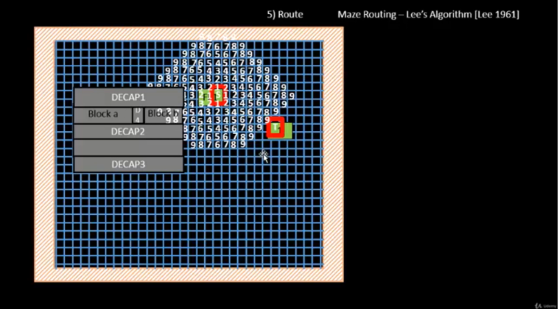
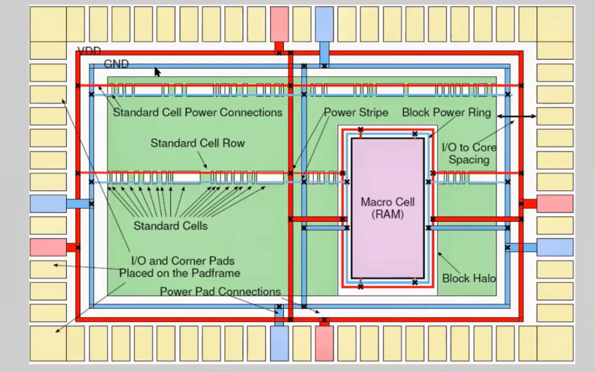
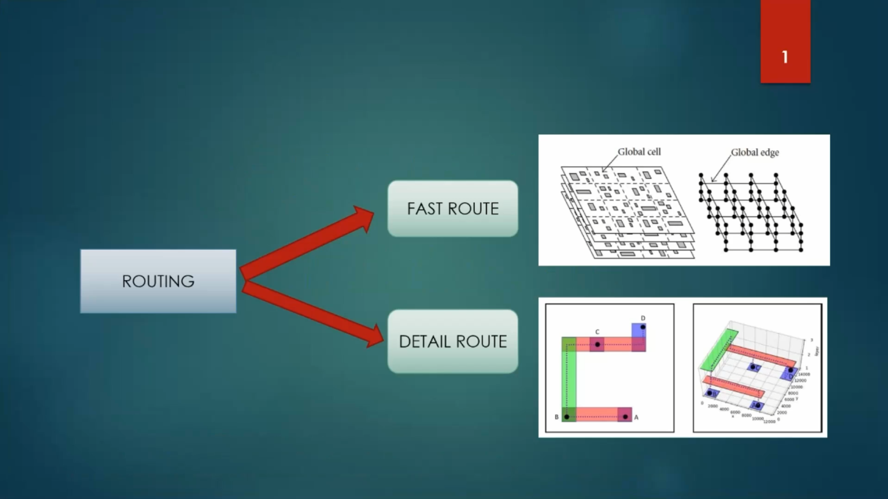
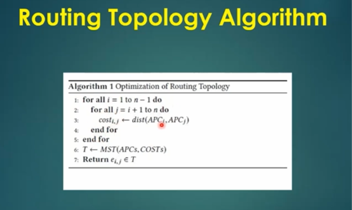

# DAY 10 — Physical Design: Routing and Final Verification

## Overview

Day 10 covers the final physical-design stages of the RTL-to-GDSII flow, with focus on **power distribution, routing, physical verification, and post-route timing analysis**.

The main topics covered are:

- Maze routing and Lee's algorithm
- Design Rule Checking (DRC)
- Power Distribution Network (PDN)
- Power straps and cell/macro power connections
- Global and detailed routing
- TritonRoute and its routing features
- Routing connectivity and topology
- Post-route files and parasitic extraction
- OpenSTA-based timing verification

---

## Objectives

By the end of this module, the following concepts are covered:

- Final stages of the RTL-to-GDSII physical-design flow
- Maze routing and Lee's algorithm
- Purpose and operation of DRC
- Construction of a power distribution network
- Power straps and standard-cell power connections
- Global routing versus detailed routing
- TritonRoute and its role in detailed routing
- Routing guides, connectivity, and layer transitions
- Routing topology and post-route design files
- OpenSTA for post-route timing analysis

---

## Tools and Technologies

| Tool / Technology | Purpose |
|---|---|
| **OpenLane** | Automated RTL-to-GDSII physical-design flow |
| **OpenROAD** | Physical implementation and optimization |
| **TritonRoute** | Detailed routing |
| **OpenSTA** | Static timing analysis |
| **Yosys** | RTL synthesis |
| **SKY130** | Open-source 130 nm process technology |
| **LEF** | Physical cell and technology information |
| **DEF** | Physical placement and routing representation |
| **SDC** | Timing constraints |
| **SPEF** | Extracted parasitic information |
| **Tcl** | Flow configuration and automation |
| **Docker** | Execution environment |

---

## RTL-to-GDSII Final Flow

The final part of the physical-design flow continues from the placed and clocked design toward a manufacturable physical layout.

```text
RTL
 ↓
Synthesis
 ↓
Floorplanning
 ↓
Power Distribution
 ↓
Placement
 ↓
Clock Tree Synthesis
 ↓
Global Routing
 ↓
Detailed Routing — TritonRoute
 ↓
DRC
 ↓
Parasitic Extraction
 ↓
Post-Route Timing Analysis — OpenSTA
 ↓
Final Layout
 ↓
GDSII
```

The final implementation stages mainly establish physical connectivity while satisfying timing, electrical, and manufacturing constraints.

---

## Maze Routing and Lee's Algorithm

### Maze Routing

Maze routing treats the routing area as a grid and searches for a valid path between two points while avoiding blocked regions.

In VLSI, it can be used to understand how metal connections can be created between pins and terminals while respecting obstacles and routing restrictions.

### Lee's Algorithm

Lee's algorithm is a grid-based routing method that expands a wavefront from the source until the destination is reached. The final route is then obtained by tracing backward through the explored grid.

### Basic Procedure

1. Mark the source as the starting point.
2. Expand to neighboring grid locations.
3. Avoid blocked or unavailable locations.
4. Continue until the destination is reached.
5. Backtrack from the destination.
6. Reconstruct the routing path.

### Advantages

- Systematic path exploration
- Can find a shortest path in an unweighted grid when a path exists
- Naturally handles obstacles
- Useful for understanding maze-routing concepts

### Limitations

- Can consume significant memory for large grids
- May explore many unnecessary locations
- Does not by itself model all practical routing costs such as congestion, wire delay, and layer preferences



---

## Design Rule Checking

**Design Rule Checking (DRC)** verifies whether the physical layout follows the manufacturing rules of the selected semiconductor technology.

Typical rules include:

- Minimum metal width
- Minimum spacing between metal wires
- Minimum via spacing
- Enclosure requirements
- Minimum area requirements
- Restrictions on overlapping or incorrectly connected shapes

During routing, the tools must create connections without violating these rules.

A **DRC-clean** result means that the checked layout satisfies the applicable rules for that verification run. It does not, by itself, prove that timing, connectivity, or other physical requirements are satisfied.


---

## Power Distribution Network

### What is a PDN?

A **Power Distribution Network (PDN)** distributes power and ground throughout the physical design.

It provides the required supply connections to standard cells, macros, and other circuit elements while helping maintain acceptable voltage levels.

### Purpose of the PDN

A PDN is used to:

- Distribute power and ground across the chip
- Connect standard cells and macros to the supply network
- Reduce voltage drop along power paths
- Support current delivery across different regions
- Create a structured connection between the supply source and circuit elements

### Main Components

A typical PDN can contain:

1. Power and ground pins
2. Power rings
3. Power straps
4. Standard-cell power rails
5. Macro power connections
6. Vias between power-carrying metal layers

### PDN Construction

```text
Power / Ground Definition
        ↓
Power Ring Generation
        ↓
Power Strap Generation
        ↓
Power Rail Connection
        ↓
Cell and Macro Connections
        ↓
Power Connectivity Verification
```

In an OpenROAD-based flow, PDN generation can be invoked with:

```tcl
pdngen
```

The actual configuration determines the power nets, metal layers, geometry, and connections required by the design and technology.

---

## Power Straps and Power Connections

### Power Straps

Power straps are wider metal conductors used to distribute power and ground across the core.

They connect the larger power-distribution structure to local power connections and are generally placed on selected metal layers using vias for layer transitions.

### Standard-Cell Power Connections

Standard cells receive supply and ground through their dedicated power pins and the power rails associated with the placement rows.

The PDN connects these local rails to the larger chip-level power network.

### Macro Power Connections

Macros such as RAM blocks can have dedicated power pins and physical power requirements.

The PDN must connect these macro pins to the broader power network.




### Important PDN Considerations

- Metal-layer selection
- Strap width and spacing
- Via connectivity
- Current demand
- Voltage drop
- Macro placement
- Power-pin locations
- Connectivity between local rails and the main network

---

## Global and Detailed Routing

### Global Routing

Global routing determines approximate paths for nets through the available routing resources.

The routing area is divided into coarse regions, and the router determines which regions a net should pass through.

Its main purposes are:

- Estimate routing paths
- Manage congestion
- Allocate routing resources
- Identify routing bottlenecks
- Generate routing guides

### Detailed Routing

Detailed routing converts the approximate paths into actual physical wires and vias.

It works with the exact geometry of the design and considers:

- Wire locations
- Metal-layer selection
- Via placement
- Design-rule restrictions
- Electrical connectivity
- Local congestion
- Routing obstacles

### Comparison

| Feature | Global Routing | Detailed Routing |
|---|---|---|
| Level | Coarse | Fine-grained |
| Main representation | Routing-resource regions | Physical wires and vias |
| Output | Routing guides | Routed geometry |
| Main concern | Congestion and resource allocation | Connectivity and design-rule compliance |

### Routing Flow

```text
Placed and Clocked Design
        ↓
Global Routing
        ↓
Routing Guides
        ↓
Detailed Routing
        ↓
DRC
        ↓
Parasitic Extraction
        ↓
Post-Route Timing Analysis
```

---

## TritonRoute

### Introduction

**TritonRoute** is the detailed-routing engine used in the OpenROAD physical-design flow.

It takes routing information from the global-routing stage and turns it into actual metal segments and vias while considering routing constraints and design rules.

### Role of TritonRoute

TritonRoute handles tasks such as:

- Processing routing guides
- Connecting design pins
- Routing across different metal layers
- Handling physical obstacles
- Resolving routing conflicts
- Maintaining design-rule compliance

The basic relationship is:

```text
Global Routing
      ↓
Routing Guides
      ↓
TritonRoute
      ↓
Detailed Wires and Vias
      ↓
Routing Verification
      ↓
Post-Route Design
```

A basic OpenROAD detailed-routing command is:

```tcl
detailed_route
```

The available options and exact behavior depend on the OpenROAD version and flow configuration.

---

## TritonRoute Features

### Routing Guides

Global routing produces guides that indicate the approximate regions through which a net should travel.

TritonRoute uses these guides to direct detailed routing and reduce unnecessary exploration.

They help to:

- Provide routing direction
- Use allocated routing resources
- Coordinate global and detailed routing
- Restrict unnecessary search outside selected regions




### Inter-Guide Connectivity

A single net can have multiple routing guides in different regions.

Inter-guide connectivity means joining those guide segments so that the complete net forms one continuous electrical path.

### Intra-Layer Routing

Intra-layer routing creates a connection while remaining on the same metal layer unless a layer change is required.

### Inter-Layer Routing

Inter-layer routing connects conductors located on different metal layers.

**Vias** provide the electrical connection between those layers.

A simplified connection can be represented as:

```text
Source Pin
    ↓
Metal Layer 1
    ↓
Via
    ↓
Metal Layer 2
    ↓
Via
    ↓
Destination Pin
```

### Connectivity Handling

TritonRoute must maintain complete electrical connectivity between the terminals of every routed net.

This includes:

- Connecting source and destination pins
- Joining separate route segments
- Handling layer transitions
- Avoiding disconnected wires
- Resolving conflicts without losing connectivity

---

## Routing Connectivity and Optimization

### Routing Connectivity

Routing connectivity means that every required terminal of a net has a continuous physical electrical path.

Connectivity checks can identify open or incomplete connections.

### Routing Obstacles

Obstacles restrict where wires or vias can be placed.

Examples include:

- Macro blockages
- Existing routed wires
- Restricted routing regions
- Design-rule spacing requirements
- Pin-access limitations

The detailed router must account for these restrictions while finding valid routes.

### Routing Optimization

Routing optimization improves the physical implementation while preserving connectivity.

Important factors include:

- Wirelength
- Congestion
- Design-rule compliance
- Via count
- Signal delay
- Routing-resource utilization

---

## Routing Topology

Routing topology describes how branches and terminals are arranged within the physical structure of a net.

For a multi-terminal net, the topology determines how all terminals are interconnected.

The chosen topology can affect:

- Wirelength
- Routing-resource usage
- Parasitic characteristics
- Overall routing structure



---

## Final Post-Route Files

After detailed routing, the physical-design flow generates files describing the routed design and its physical characteristics.

| File | Purpose |
|---|---|
| **DEF** | Physical placement and routing information |
| **LEF** | Physical cell and technology information |
| **Verilog** | Gate-level connectivity representation |
| **SPEF** | Extracted parasitic information |
| **SDC** | Timing constraints |
| **GDSII** | Physical layout representation |
| **Timing reports** | Timing-analysis results |
| **DRC reports** | Physical design-rule verification results |

The exact output files depend on the flow configuration and the stages completed.

### DEF and Routed Geometry

The DEF representation can contain information about component placement, pins, nets, and routing geometry.

After routing, it can be used for further physical analysis and verification.

### Parasitic Extraction

Parasitic extraction estimates the resistance and capacitance introduced by physical interconnects.

These values affect signal propagation delay and are used during post-route timing analysis.

---

## Post-Route Timing Analysis

Post-route timing analysis evaluates the routed implementation using timing constraints and available parasitic information.

**OpenSTA** performs static timing analysis by calculating values such as:

- Arrival time
- Required arrival time
- Setup slack
- Hold slack

A simplified flow is:

```text
Routed Netlist
      ↓
Timing Constraints — SDC
      ↓
Parasitic Information
      ↓
OpenSTA
      ↓
Arrival / Required Time
      ↓
Setup and Hold Slack
      ↓
Timing Verification
```

Post-route analysis is important because the actual physical interconnect contributes resistance and capacitance that influence timing.

---

## Final Verification Checklist

Before considering the final physical-design stage complete:

- Power distribution network generated
- Global routing completed
- Detailed routing completed
- Routing connectivity checked
- DRC performed
- Parasitic information generated where applicable
- Post-route timing analysis performed
- Final physical-design files generated

---

## Key Observations

1. **Maze routing:** Lee's algorithm provides a systematic method for exploring paths between routing points.
2. **DRC:** Physical geometry must satisfy the manufacturing rules of the selected technology.
3. **Power distribution:** The PDN supplies power and ground to standard cells and macros.
4. **Power straps:** Wider metal paths distribute power across the core.
5. **Global routing:** Approximate net paths and routing guides are generated.
6. **Detailed routing:** TritonRoute converts routing guides into physical wires and vias.
7. **Connectivity:** Every required terminal of a net must have a continuous electrical path.
8. **Routing topology:** The arrangement of branches affects wirelength, routing resources, and parasitics.
9. **Post-route analysis:** Extracted parasitics and timing analysis help evaluate the physically routed design.

---

## Conclusion

This module completes the final routing and verification stages of the RTL-to-GDSII physical-design flow.

The work covers maze routing, DRC, power distribution, power straps, global and detailed routing, TritonRoute, routing connectivity, and routing topology.

The final stages also generate post-route physical files, extract interconnect parasitics, and perform timing verification using OpenSTA.

Overall, the module shows how the design moves from a placed and clocked implementation to a routed physical layout that can undergo final verification and GDSII generation.

<!-- IMAGE PLACEHOLDER: Any additional screenshots from the reference README can be inserted here without changing the visible README text. -->
