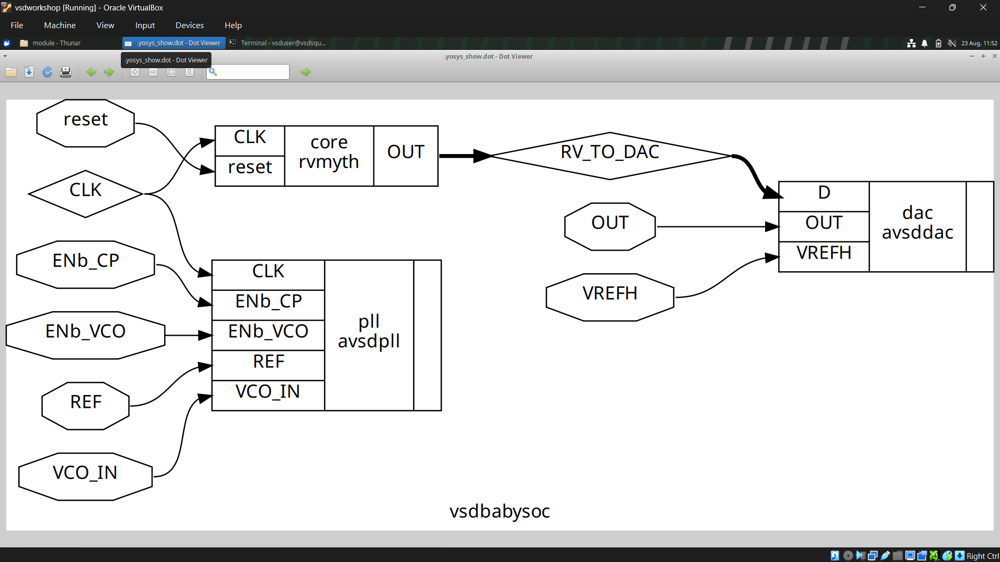
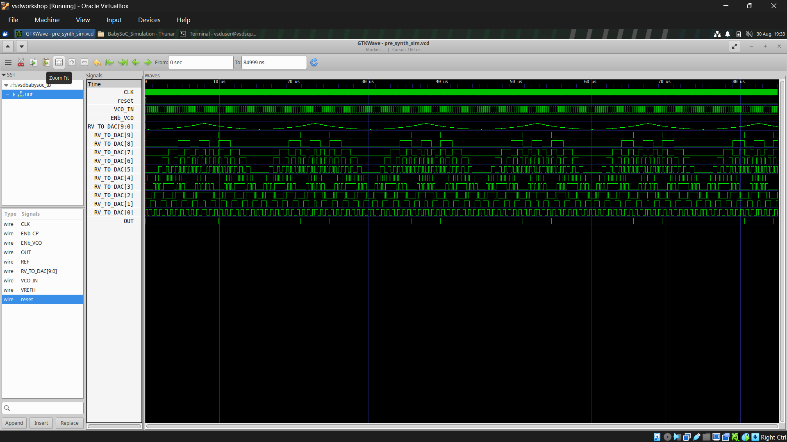
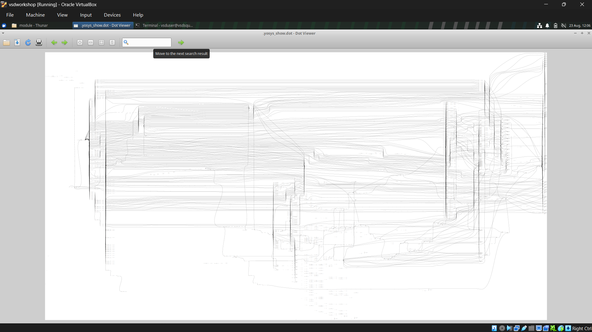
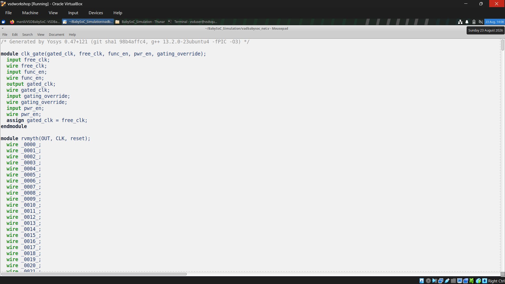
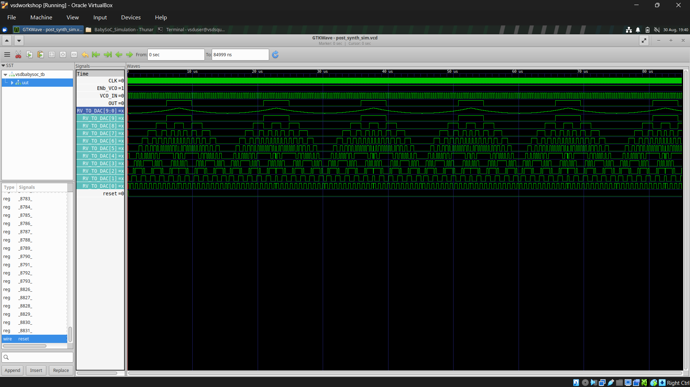
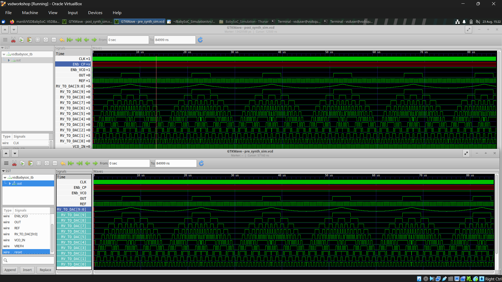

# VSDIAT BabySoC – RTL to Post-Synthesis Implementation

This repository documents the implementation and verification of the **BabySoC** through the initial stages of an ASIC design flow. The project provides practical exposure to RTL design, simulation, synthesis, technology mapping, gate-level netlist generation, and post-synthesis verification.

The primary objective is to understand how an SoC described at the **Register Transfer Level (RTL)** is progressively transformed into a technology-specific gate-level implementation while ensuring that its intended functionality is maintained.

---

## 1. Introduction to BabySoC

**BabySoC** is a small System-on-Chip design that combines digital processing with clock-generation and digital-to-analog interface blocks.

The design contains three major components:

### RVMyth

RVMyth is the main **RISC-V based processor core** of the BabySoC. It performs the digital processing operations and produces the data that is eventually supplied to the DAC.

The processor generates a 10-bit digital signal:

```text
RV_TO_DAC[9:0]
```

This signal represents the digital information transferred from the processor to the DAC.

### AVSDPLL

The **AVSDPLL** block is responsible for clock generation. It produces the clock signal required by the digital processor.

The PLL receives control and reference-related inputs such as:

```text
ENb_CP
ENb_VCO
REF
VCO_IN
```

and generates the clock used by the digital portion of the SoC.

### AVSDDAC

The **AVSDDAC** block receives the processor's digital output and converts it into the corresponding DAC output.

Important signals associated with this block include:

```text
RV_TO_DAC[9:0]
VREFH
OUT
```

The overall relationship between the blocks is therefore:

**PLL → Processor → DAC**

The top-level module integrating these blocks is:

```text
vsdbabysoc
```

---

## 2. Design Hierarchy

The BabySoC is organized hierarchically around the `vsdbabysoc` top-level module.

```text
vsdbabysoc
├── avsddpll
├── rvmyth
└── avsddac
```

The hierarchy makes it possible to separate different functional portions of the SoC while integrating them through the top-level design.

The `rvmyth` module contains the primary digital processing logic. Its 10-bit `RV_TO_DAC[9:0]` output is connected to the DAC block, while the clock generated by `avsddpll` is used by the digital logic.

### VSDBABYSOC Module View



This screenshot shows the **VSDBABYSOC module generated using Yosys/Dot Viewer**. It provides a graphical view of the synthesized module and its internal connectivity, making the transformation from the RTL hierarchy to synthesized logic easier to observe.

---

# 3. ASIC Implementation Flow

The project follows the conventional progression from RTL design toward physical implementation.

The major stages covered by this work are:

```text
RTL Design
    ↓
Pre-Synthesis Simulation
    ↓
Logic Synthesis
    ↓
Technology Mapping
    ↓
Gate-Level Netlist
    ↓
Post-Synthesis Simulation
```

The later stages of the complete ASIC flow include **Static Timing Analysis, floorplanning, placement, Clock Tree Synthesis, routing, physical verification, and GDSII generation**.

The important idea behind this flow is that each stage provides a progressively more implementation-oriented representation of the same hardware design.

---

# 4. RTL Design

The BabySoC is initially described using **Verilog HDL**.

Important RTL source files include:

```text
rtl/
├── vsdbabysoc.v
├── rvmyth.v
└── clk_gate.v
```

The top-level RTL module is:

```text
vsdbabysoc
```

At RTL, the designer describes the required behavior and the relationships between registers, combinational logic, and modules.

The RTL representation is not yet tied to individual standard cells. For example, an RTL description can express operations such as multiplexing, arithmetic, storage, and conditional logic without specifying exactly which NAND, NOR, multiplexer, or flip-flop cells will implement those operations.

This abstraction makes RTL suitable for functional verification before moving into technology-dependent implementation.

---

# 5. Pre-Synthesis Functional Simulation

Before synthesis, the RTL design was simulated to verify its functional behavior.

The simulation environment uses:

* **Icarus Verilog** for compilation and simulation
* **GTKWave** for waveform visualization
* A testbench to provide the required input stimulus

The generated waveform is stored in VCD format and can be inspected using GTKWave.



This screenshot shows the **pre-synthesis RTL simulation waveform** captured in GTKWave. It provides the reference behavior of the original RTL design before synthesis and is later used for comparison with the post-synthesis waveform.

The important signals monitored during simulation include:

```text
CLK
REF
reset
VCO_IN
VREFH
RV_TO_DAC[9:0]
OUT
```

### Importance of RTL Simulation

RTL simulation provides an early opportunity to identify functional problems before synthesis.

At this stage, the focus is primarily on questions such as:

* Are the inputs being applied correctly?
* Is reset behaving as expected?
* Is the processor producing the expected digital output?
* Is the DAC receiving the correct digital data?
* Is the overall output behaving correctly?

The `RV_TO_DAC[9:0]` signal is particularly important because it provides a direct indication of the digital data generated by the processor.

---

# 6. Logic Synthesis

Once the RTL has been functionally verified, it is converted into a synthesized representation using **Yosys**.

Synthesis is the process of translating RTL constructs into hardware logic while applying optimizations to produce an efficient implementation.

During synthesis, the design moves from an abstract RTL description toward actual hardware structures such as:

* Combinational logic
* Multiplexers
* Flip-flops
* Logic gates
* Technology-specific standard cells

The synthesis process also attempts to remove unnecessary logic and simplify the resulting implementation.

---

# 7. Yosys Synthesis Process

The major Yosys commands used in the implementation include:

```text
read_verilog
dfflibmap
opt
abc
show
flatten
setundef -zero
clean -purge
rename -enumerate
write_verilog
```

### `read_verilog`

This command reads the Verilog source files and loads the RTL design into Yosys.

### `dfflibmap`

`dfflibmap` maps the flip-flop representations used by Yosys to compatible flip-flop cells available in the selected technology library.

### `opt`

The `opt` command performs optimization of the synthesized representation. It can eliminate redundant logic and propagate known constants.

### `abc`

ABC is used for logic optimization and technology mapping. It helps convert the optimized logic into cells available in the target standard-cell library.

### `show`

The `show` command can be used to generate a graphical representation of the synthesized design.

### RVMyth Synthesized View



This screenshot shows the **RVMyth block in Dot Viewer after synthesis**. The generated view illustrates the internal logic structure and connections of the processor portion of the BabySoC after synthesis processing.

### `flatten`

Flattening removes module boundaries by incorporating lower-level module logic into the parent design.

This is useful when a flat representation of the complete synthesized design is required. You can make a netlist at this step if needed.

### `setundef -zero`

Undefined values are converted to logic zero in the synthesized representation.

### `clean -purge`

Unused and redundant objects are removed from the design.

### `rename -enumerate`

Generated objects are systematically renamed to produce an organized netlist.

### `write_verilog`

Finally, the synthesized representation is written out as a Verilog gate-level netlist.

---

# 8. Technology Library – SKY130

The synthesis flow targets the **SKY130** open-source semiconductor technology.

The standard-cell library used is:

```text
sky130_fd_sc_hd
```

The Liberty timing library used for the synthesis process is:

```text
sky130_fd_sc_hd__tt_025C_1v80.lib
```

A technology library contains the cells that are available for implementing the design.

Instead of leaving a logical operation as an abstract RTL construct, synthesis can select actual cells from the target library.

Examples of cells found in the synthesized implementation include:

```text
sky130_fd_sc_hd__nand2_1
sky130_fd_sc_hd__nor2_1
sky130_fd_sc_hd__and2_0
sky130_fd_sc_hd__mux2_1
sky130_fd_sc_hd__xor2_1
sky130_fd_sc_hd__dfrtp_1
```

These represent different types of combinational and sequential standard cells.

For example, `nand2`, `nor2`, `and2`, `mux2`, and `xor2` represent combinational logic, while `dfrtp` represents a flip-flop based sequential element.

---

# 9. From RTL to Standard Cells

One of the most important outcomes of synthesis is the change in the representation of the design.

At RTL, the design is expressed using Verilog constructs and module-level behavior.

After synthesis and technology mapping, the design is represented using actual cells from the SKY130 library.

Therefore, the transformation can be understood as:

```text
RTL Description
      ↓
Optimized Logic
      ↓
SKY130 Standard Cells
```

The synthesized implementation contains **thousands of standard-cell instances**.

This demonstrates how a relatively compact RTL description can expand into a large collection of interconnected gates and sequential elements when translated into a technology-specific hardware implementation.

---

# 10. Gate-Level Netlist

After synthesis and technology mapping, the resulting design is exported as:

```text
baby_soc_netlist3.v
```

This file represents the synthesized BabySoC using SKY130 standard-cell instances.

Unlike the original RTL, the gate-level netlist describes the implementation in terms of specific library cells and their connections.

The gate-level netlist therefore provides an intermediate representation between RTL design and the eventual physical implementation.

It can also be used to verify that synthesis has maintained the required functional behavior.

### VSDBABYSOC Gate-Level Netlist



This screenshot shows the **synthesized VSDBABYSOC gate-level netlist** generated after technology mapping. The RTL constructs have been replaced by interconnected SKY130 standard-cell instances, representing the design in a technology-specific form.

---

# 11. Post-Synthesis Gate-Level Simulation

After generating the synthesized netlist, the design was simulated again at the gate level.

The post-synthesis simulation uses:

* **Icarus Verilog**
* **SKY130 Verilog standard-cell models**
* **Original testbench**
* **GTKWave**

The simulation was configured with:

```text
-DPOST_SYNTH_SIM
-DFUNCTIONAL
-DUNIT_DELAY=#1
```

The SKY130 Verilog models provide the functional definitions of the standard cells present in the synthesized netlist.

This allows the gate-level implementation to be simulated in a manner similar to the original RTL.

The resulting waveform is generated as:

```text
post_synth_sim.vcd
```

and inspected using GTKWave.



This screenshot shows the **post-synthesis gate-level simulation waveform** in GTKWave. It represents the behavior of the synthesized netlist using the SKY130 standard-cell models and provides the basis for checking whether the synthesized implementation behaves as expected.

---

# 12. RTL vs Post-Synthesis Verification

A major purpose of post-synthesis simulation is to determine whether synthesis has preserved the functional behavior of the original RTL.

The RTL and synthesized implementations were compared using GTKWave.

The primary signals considered were:

```text
CLK
REF
reset
RV_TO_DAC[9:0]
OUT
```

The comparison focuses on whether the same input conditions result in the expected functional activity after synthesis.

The `RV_TO_DAC[9:0]` bus continues to exhibit the expected digital sequence in the synthesized implementation.

Similarly, the DAC output `OUT` continues to show the expected waveform behavior.

### Pre-Synthesis vs Post-Synthesis Waveform Comparison



This comparison places the **pre-synthesis RTL waveform and post-synthesis GLS waveform** side by side for verification. The corresponding signal activity can be examined to confirm that synthesis has preserved the expected functional behavior of the BabySoC.

This provides evidence that the synthesized gate-level implementation maintains the intended functionality of the RTL for the applied testbench.

It is important to note that synthesis changes **how the circuit is implemented**, but it should not change **what the circuit is intended to do**.

---

# 13. Functional GLS and Timing GLS

The current post-synthesis simulation is a **functional Gate-Level Simulation (GLS)**.

Functional GLS primarily checks logical correctness using the synthesized gate-level netlist and standard-cell models.

### Functional GLS

Functional GLS answers the question:

> Does the synthesized gate-level circuit still produce the expected logical behavior?

The emphasis is therefore on functional equivalence and correct signal behavior.

### Timing GLS

Timing GLS goes further by incorporating cell propagation delays and, depending on the implementation stage, interconnect delays.

Timing simulation can reveal effects such as:

* Propagation delay
* Output transitions occurring later than the input changes
* Setup and hold related behavior
* Delay through synthesized logic paths

The current simulation is not a replacement for **Static Timing Analysis (STA)**. STA will later provide a more systematic analysis of timing constraints and critical paths.

---

# 14. Tools Used

The implementation makes use of an open-source digital ASIC toolchain.

### Verilog HDL

Used to describe the BabySoC RTL and the synthesized gate-level representation.

### Icarus Verilog

Used for both RTL simulation and post-synthesis gate-level simulation.

### GTKWave

Used to view and analyze simulation waveforms and compare important signals between different simulation stages.

### Yosys

Used for RTL synthesis, optimization, design processing, and generation of the synthesized netlist.

### ABC

Used as part of the synthesis flow for logic optimization and technology mapping.

### SKY130

Provides the target semiconductor technology and standard-cell library used during technology mapping.

### Linux

The complete implementation environment is based on Linux.

---

# 15. Learning Outcomes

The BabySoC project provides practical understanding of the early stages of an ASIC implementation flow.

The major concepts covered include:

* Understanding a small SoC architecture
* Working with hierarchical RTL designs
* Writing and understanding Verilog RTL
* Performing pre-synthesis simulation
* Reading and analyzing waveforms
* Understanding the purpose of synthesis
* Using Yosys for RTL synthesis
* Applying logic optimization
* Mapping flip-flops to library cells
* Using ABC for technology mapping
* Working with the SKY130 standard-cell library
* Understanding Liberty timing libraries
* Generating a gate-level netlist
* Performing functional gate-level simulation
* Comparing RTL and synthesized waveforms
* Understanding the difference between functional GLS and timing GLS
* Understanding how RTL eventually becomes technology-specific hardware

---

# 16. Significance of the Implementation

The project demonstrates an important principle of digital ASIC design:

**RTL is an abstract description of the required hardware behavior, while synthesis converts that description into an optimized implementation using cells supported by a particular semiconductor technology.**

The synthesized circuit may look significantly different from the original RTL because synthesis can optimize logic, flatten hierarchy, rename objects, and replace RTL constructs with standard-cell implementations.

Despite these structural changes, the expected functional behavior should remain consistent.

Successful post-synthesis simulation therefore provides an important verification point before proceeding toward timing analysis and physical implementation.

---

# 17. Project Milestone

The BabySoC implementation has successfully reached the post-synthesis simulation stage.

The completed work covers:

**RTL Development → RTL Simulation → Synthesis → SKY130 Technology Mapping → Gate-Level Netlist → Post-Synthesis Simulation**

The next major stage is **Static Timing Analysis (STA)**.

Following STA, the design can progress toward:

* Floorplanning
* Placement
* Clock Tree Synthesis
* Routing
* Physical Verification
* GDSII generation

The overall project therefore provides a practical transition from **behavioral RTL to synthesized ASIC hardware**, forming the foundation for the remaining physical design stages.
